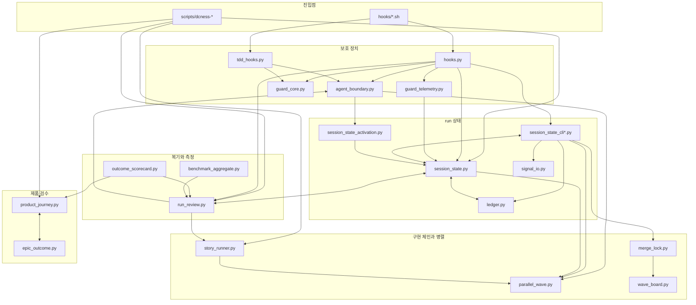

# harness 모듈 의존 그래프

> dcNess self 전용 문서다. plug-in 배포물이 아니다.
> `harness/` 안의 Python 모듈이 서로를 어떻게 import 하는지와, 바깥 디렉터리가 `harness/` 를 어떻게 호출하는지 적는다.
> 기준 커밋은 `04b4d511` 이다. 요약은 [`harness/CLAUDE.md`의 의존 관계 절](../../harness/CLAUDE.md)에 있다.

## 읽는 방법

- 화살표 `A --> B` 는 "A 가 B 를 import 한다"는 뜻이다.
- import 는 Python `ast` 로 읽었다. 함수 안에서 하는 import 도 포함한다.
- 이 문서는 자동으로 갱신되지 않는다. `harness/` 에 모듈을 추가하거나 import 를 바꾸면 이 문서를 함께 고친다.

## 묶음 단위 그래프

## 수정할 때 알아야 할 점

- `session_state.py` 는 `ledger.py`, `run_review.py`, `session_state_cli.py` 와 서로 import 한다. import 를 파일 맨 위로 옮기면 순환 import 오류가 날 수 있다.
- `product_journey.py` 와 `epic_outcome.py` 는 서로만 import 한다. run 상태 코드를 고쳐도 제품 검수 코드는 영향을 받지 않는다.
- `agent_names.py`, `parallel_wave.py`, `signal_io.py` 처럼 "import 하는 모듈" 칸이 `-` 인 파일은 `harness/` 안의 다른 모듈에 의존하지 않는다.
- `outcome_scorecard.py`, `agent_effectiveness.py`, `benchmark_aggregate.py` 는 [`scripts/release_artifact.json`](../../scripts/release_artifact.json) 의 배포 목록에 없다. 사용자 환경에서 실행되지 않는다.

## 바깥에서 harness 를 호출하는 경로

| 호출하는 곳 | 호출 대상 |
|---|---|
| `hooks/*.sh` (`tdd-guard.sh` 제외) | `harness.hooks`, `harness.session_state` |
| `hooks/tdd-guard.sh` | `harness.tdd_hooks`, `harness.agent_boundary`, `harness.guard_telemetry`, `harness.session_state`, `harness.session_state_fail_open` |
| `scripts/dcness-helper` | `harness.session_state` |
| `scripts/dcness-implementation-chain` | `harness.agent_routing`, `harness.provider_failure_cache`, `harness.run_review`, `harness.session_state`, `harness.story_runner` |
| `scripts/dcness-story-runner` | `harness.story_runner` |
| `scripts/dcness-product-journey` | `harness.product_journey` |
| `scripts/dcness-review` | `harness.run_review` |
| `scripts/dcness-tdd-hooks` | `harness.tdd_hooks` |
| `scripts/dcness-ci-workflows` | `harness.ci_workflows` |
| `scripts/dcness-context-docs` | `harness.context_docs` |
| `scripts/dcness-codex-permission` | `harness.codex_sandbox_permission` |
| `scripts/dcness-efficiency` | `harness/efficiency` |
| `evals/guard_efficacy.py` | `harness.hooks`, `harness.agent_boundary`, `harness.session_state`, `harness.session_state_cli` |
| `evals/agent_effectiveness_measure.py` | `harness.agent_effectiveness` |

## 모듈별 import 표

"import 받는 수" 는 `harness/` 안에서 이 모듈을 import 하는 모듈의 수다. 수가 클수록 공개 함수 변경의 영향 범위가 넓다.

| 모듈 | 줄 수 | import 받는 수 | import 하는 모듈 |
|---|---|---|---|
| `session_state.py` | 2100 | 9 | `agent_names`, `ledger`, `parallel_wave`, `run_review`, `session_state_cli` |
| `ledger.py` | 451 | 8 | `session_state` |
| `run_review.py` | 2133 | 7 | `agent_boundary`, `agent_names`, `context_docs`, `efficiency.analyze_sessions`, `ledger`, `session_state`, `session_state_fail_open`, `story_runner` |
| `agent_names.py` | 28 | 6 | - |
| `parallel_wave.py` | 815 | 5 | - |
| `agent_boundary.py` | 1947 | 5 | `parallel_wave`, `session_state_activation` |
| `session_state_activation.py` | 133 | 4 | `session_state` |
| `session_state_fail_open.py` | 194 | 4 | - |
| `guard_core.py` | 108 | 3 | `agent_names` |
| `signal_io.py` | 263 | 3 | - |
| `agent_routing.py` | 471 | 2 | - |
| `context_docs.py` | 496 | 2 | - |
| `design_run_records.py` | 301 | 2 | `ledger`, `run_review` |
| `prev_tasks.py` | 102 | 2 | `session_state_activation` |
| `product_journey.py` | 2430 | 2 | `epic_outcome` |
| `session_state_cli.py` | 1414 | 2 | `agent_names`, `agent_routing`, `boundary_suggestions`, `chain_view`, `design_run_records`, `ledger`, `mockup_node_check`, `parallel_wave`, `prev_tasks`, `session_state`, `session_state_cli_finalize`, `session_state_cli_wave`, `signal_io` |
| `tdd_hooks.py` | 1465 | 2 | `agent_boundary`, `guard_core`, `session_state_fail_open` |
| `wave_board.py` | 380 | 2 | - |
| `agent_effectiveness.py` | 690 | 1 | - |
| `benchmark_aggregate.py` | 483 | 1 | `ledger`, `run_review` |
| `boundary_suggestions.py` | 296 | 1 | `agent_boundary` |
| `chain_view.py` | 542 | 1 | - |
| `efficiency/analyze_sessions.py` | 325 | 1 | - |
| `epic_outcome.py` | 168 | 1 | `product_journey` |
| `guard_telemetry.py` | 317 | 1 | `session_state` |
| `pr_precheck.py` | 507 | 1 | `agent_boundary` |
| `merge_lock.py` | 363 | 1 | `guard_core`, `wave_board` |
| `mockup_node_check.py` | 224 | 1 | - |
| `provider_failure_cache.py` | 444 | 1 | - |
| `session_state_cli_finalize.py` | 455 | 1 | `agent_names`, `design_run_records`, `ledger`, `run_review`, `session_state`, `signal_io` |
| `session_state_cli_wave.py` | 331 | 1 | `merge_lock`, `parallel_wave`, `session_state`, `wave_board` |
| `story_runner.py` | 562 | 1 | `parallel_wave`, `provider_failure_cache` |
| `ci_workflows.py` | 210 | 0 | `tdd_hooks` |
| `codex_sandbox_permission.py` | 675 | 0 | `run_review`, `session_state` |
| `hooks.py` | 2156 | 0 | `agent_boundary`, `agent_names`, `guard_core`, `guard_telemetry`, `ledger`, `pr_precheck`, `prev_tasks`, `run_review`, `session_state`, `session_state_activation`, `session_state_cli`, `session_state_fail_open`, `signal_io` |
| `outcome_scorecard.py` | 721 | 0 | `agent_effectiveness`, `benchmark_aggregate`, `ledger`, `product_journey`, `run_review` |
| `session_state_status.py` | 530 | 0 | `agent_routing`, `context_docs`, `session_state_activation`, `session_state_fail_open`, `tdd_hooks` |
