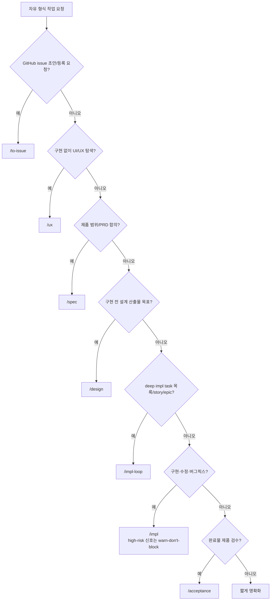

# workflow-router 분기 규칙 SSOT

> **Status**: ACTIVE
> **Scope**: 자유 형식 작업 요청을 받았을 때 어떤 workflow(skill)로 진입할지 고르는 분기 규칙의 단일 진본. skill 진입 후의 agent 결론 → 다음 호출 판단은 각 `<skill>-routing.md` 영역이다. 용어 기준 = [`terms.md`](terms.md), 강제 vs 권고 = [`CLAUDE.md`](https://github.com/Daeguk-Sun/dcNess/blob/main/CLAUDE.md).

## 읽는 법

운영 원칙: 기본은 가볍게 진행하고, 위험 신호는 먼저 경고한다. 경고는 사용자 결정을 돕기 위한 것이며 자동 차단이 아니다.

분기 규칙은 **권고**다. 코드가 강제하는 것은 작업 순서와 접근 영역이고, 진입점 선택은 메인/사용자의 판단이다. 사용자가 명시적으로 `/impl` 또는 "구현해줘"를 지시했고 concrete signal 이 있으면 구현을 우선한다. high-risk 신호는 설계 선행 권장 근거이지 자동 차단 근거가 아니다.

기본 공개 진입점은 `/spec -> /design -> /impl -> /acceptance` 다. direct / design-doc 은 `/impl` 내부 echo 이름이고 공개 command 가 아니다. 기본 공개 진입점 계약은 [`positioning.md`](positioning.md) 가 진본이다.

## gate 축 — 어떤 공개 진입점으로 갈까

1. GitHub issue 초안/등록 요청인가? → `/to-issue`
2. 구현 없이 목업·화면 흐름·디자인 시스템·디자인 토큰·베이스라인 요청인가? → `/ux`
3. PRD/제품 범위 합의가 목표인가? → `/spec`
4. PRD 이후 구현 전 설계 산출물이 목표인가? → `/design`
5. 구현·수정·버그픽스를 실제 PR 로 끝내는 요청인가? → `/impl`
6. deep impl task 파일 목록/story/epic 을 headless 로 처리하는 요청인가? → `/impl-loop`
7. 구현 완료 후 제품 관점 검수인가? → `/acceptance`

자연어뿐이고 concrete signal 이 0개인 구현 요청은 `/impl` 안에서 issue-intake 로 처리한다. 즉 `/to-issue` 등록 여부를 한 번 묻고, OK 면 생성된 issue 번호 기준으로 구현한다.

## high-risk 신호 — warn-don't-block

다음 신호가 있으면 메인은 "설계 선행을 권장"한다고 근거와 함께 표시한다. 다만 사용자가 그대로 구현을 선택하면 `/impl` 로 진행한다.

| high-risk trigger | 권장 이유 |
|---|---|
| 새 product feature / epic | 사용자 가치·범위 합의가 필요할 수 있음 |
| 외부 dependency / API / SDK / model 선택 | 실현성·비용·라이선스 검증 필요 |
| 비용 / 라이선스 / 성능 / 품질이 MVP 성패를 좌우 | PRD 최종화 전 실측·근거 검증이 유리 |
| auth / security / PII / compliance | 사후 회복 비용이 큼 |
| migration / destructive change | 되돌리기 어려움 |
| public API breakage | 다운스트림 영향 합의 필요 |
| cross-module / cross-story interface | 모듈 경계 정합 검토가 유리 |

권고 → 강제 자동 승격 금지. 경고 후 사용자가 진행하면 branch / PR / TDD / lint-build-test / impl-validator / CI safety gate 를 유지한 채 구현한다. 구현 중 되돌리기 어려운 변경을 실제 수행해야 하면 그 순간 영향과 선택지를 보고하고 사용자 결정을 받는다.

## 분기 그래프

## 구현 경로 표

| 구현 경로 | 트리거 | 진입점 | 왜 이 경로 |
|---|---|---|---|
| **issue-intake** | 구현 요청이 자연어뿐이고 concrete signal 이 없음 | `/impl` 이 사용자에게 `/to-issue` 등록 후 구현 진행 여부 확인 | issue 본문이 AC·맥락·히스토리 기준이 되어 바로 코드 수정으로 밀지 않음 |
| **direct** | 파일 path · 함수/클래스/symbol · 이미 분류/승인된 issue/PR 번호 · 명시 테스트 명령 · 작은 docs-only/refactor 등 concrete signal 이 있음 | `/impl` — 메인 직접 `test -> impl -> test pass -> impl-validator -> PR` | 의도·범위·수용 기준이 신호로 이미 명확. high-risk 신호는 권고로 표시하되 차단하지 않음 |
| **design-doc** | 설계 문서 경로가 입력됨 | `/impl` — `--design-doc` 기록 후 받은 설계도로 메인이 구현 + 격리 `impl-validator` | impl 은 설계 생성 X. 받은 설계도 충실 구현과 review gate 유지 |
| **shape: chain** | story/epic deep task 파일 목록을 처리 | `/impl-loop` — build-worker task commit 누적 후 merge candidate `impl-validator` 1회 | 실행 형태. 일반 구현 진입점이 아니라 SDD 설계도 기반 headless runner |

## tech-review / architecture-validator 조건

경량화는 사전 ceremony 를 줄이는 것이지 검증을 없애는 것이 아니다.

| 조건 | 처리 |
|---|---|
| 새 외부 dependency / API / SDK / model 선택이 없음 | `/tech-review` 생략 가능 |
| 새 외부 dependency / API / SDK / model 선택이 필요함 | `/spec` 또는 `/design` 에서 tech-review preflight 를 권장. 사용자가 `/impl` 진행을 선택하면 구현 중 영향/선택지를 보고 |
| auth / security / PII / compliance, migration, public API breakage, cross-module interface 영향 | 설계 선행 권장. 그래도 `/impl` 진행 시 사용자 결정과 검증 증거를 남김 |
| concrete signal 이 충분함 | `/impl` direct. architecture-validator 호출 없음 |
| SDD 설계도 task 파일이 있음 | `/impl-loop` |

## low-risk regression scenario

| # | 요청 예시 | 올바른 처리 | 회귀 |
|---|---|---|---|
| R1 | 파일/symbol 명시한 "이 함수 버그 고쳐줘" | `/impl` direct | `/spec` 재기획으로 우회 |
| R2 | 작은 docs-only 오타/문구 수정 | `/impl` direct | full 설계 검증 호출 |
| R3 | 이미 분류·승인된 issue/PR 번호 "구현해줘" | `/impl` direct | `/spec` 재기획으로 우회 |
| R4 | 새 외부 API/SDK/model 도입이 필요 | 설계 선행 권장 + 사용자 선택 | 경고 없이 direct 직행 또는 사용자 의사와 무관한 강제 되돌림 |

경량화 대상은 사전 ceremony 이지 safety gate(branch / PR / test / review / CI / false-clean 방지)가 아니다.

## 되돌림(backpressure) 원리

되돌림은 downstream 단계가 upstream 산출물 부족을 발견했을 때 보강을 권장하는 정상 루프다. 다만 `/impl` 에서 사용자가 명시적으로 구현을 지시한 경우, LLM 판단만으로 자동 되돌림하지 않는다. 설계 선행은 권고와 사용자 결정으로 처리한다.

| 되돌림 경로 | 발견 주체 → 목적지 | 트리거 | 비고 |
|---|---|---|---|
| **design → spec** | design 중 PRD/요구사항 부족 발견 → 메인 `/spec` 재진입 권고 | 설계 agent가 PRD 충돌/누락(`ESCALATE`) 또는 미검증 새 외부 의존(`NEW_DEP_ESCALATE`) 보고 | 진본 = [`design-routing.md` escalate 처리](../../skills/design/design-routing.md#escalate-처리) |
| **impl → 사용자 결정** | 구현 중 되돌리기 어려운 영향 발견 → 사용자에게 설계 선행/계속 진행 선택지 보고 | high-risk 영향이 실제 코드 변경 지점에서 구체화 | 자동 `/spec`·`/design` 되돌림 금지 |
| **review → 구현** | impl-validator FAIL → finding-class 에 따라 메인 root-cause 수정 | finding 발생 | 단계 내부 되돌림. retry 한도는 [`impl-routing.md`](../../skills/impl/impl-routing.md) |

단계 내부 되돌림과 단계 간 되돌림은 같은 원리의 다른 반경이다. 같은 영역 부족이 반복되면 점 패치 retry 로 한도를 소진하지 말고 근본 원인을 본다.

## to-issue 와 작업 분기의 경계

- **to-issue** = 사용자가 문제/작업 후보를 GitHub issue 로 만들려는 의도가 있을 때 사용한다.
- issue 생성, Project field 설정, repo label 부여가 목표인 요청은 `/to-issue` 로 보낸다.
- 버그를 바로 고칠 요청은 `/impl` 로 보낸다.
- `/to-issue 외` 경로에서 agent 가 issue 생성을 제안하거나 수행해야 할 때도 `scripts/check_issue_body.mjs` 로 body 를 먼저 검증한다.
- **acceptance gap issue** = [`/acceptance`](../../skills/acceptance/acceptance-routing.md) 제품 검수 후속이다.
- **본 분기 규칙** = 자유 형식 작업 요청을 사전 분류해 진입점을 고른다.

이미 승인된 GitHub issue/PR 번호를 "구현/수정해줘"는 그 자체가 concrete signal 이라 곧장 `/impl` 로 들어간다.

## 하위 분기 규칙과의 관계

본 문서는 진입점을 고르는 데서 끝난다. skill 진입 후의 agent 결론 → 다음 호출 판단은 각 skill 의 `<skill>-routing.md` 가 진본이다:

- `/impl` → [`impl-routing.md`](../../skills/impl/impl-routing.md)
- `/spec` → [`spec-routing.md`](../../skills/spec/spec-routing.md)
- `/impl-loop` → [`impl-loop-routing.md`](../../skills/impl-loop/impl-loop-routing.md)
- `/design` → [`design-routing.md`](../../skills/design/design-routing.md)
