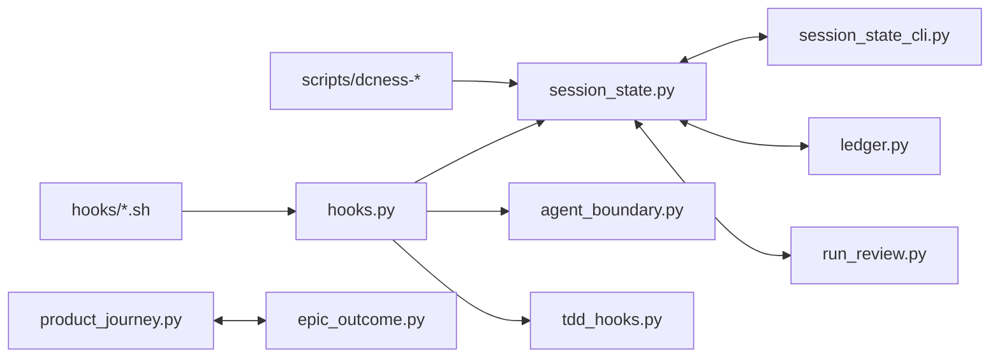

# harness 모듈 안내

전역 작업 규칙은 [../CLAUDE.md](../CLAUDE.md)가 진본이다. 이 파일은 `harness/` 안에서
어디를 먼저 볼지 좁혀 주는 컴퍼스다.

## 소유 범위

- Claude Code hook 핸들러, run/session 상태, file boundary, agent routing, validation prose
  I/O를 담당하는 플러그인 런타임 코드.
- 외부 활성 프로젝트에서 실제로 실행되는 보호 장치이므로 dcness self 에서 통과해도 사용자
  프로젝트에서의 경로와 상태 파일을 같이 생각해야 한다.
- 비용/효율 측정, guard telemetry, parallel wave, merge lock 같은 운영 보조 상태도 이 모듈에
  모여 있다.

## 먼저 볼 파일

- [hooks.py](hooks.py): SessionStart, PreToolUse, PostToolUse, Stop 계열 hook 진입점.
- [session_state.py](session_state.py)와 [session_state_cli.py](session_state_cli.py):
  harness-state의 session/run/live 상태 진본.
- [agent_boundary.py](agent_boundary.py): sub-agent Read/Write/Bash/MCP mutation 경계.
- [pr_precheck.py](pr_precheck.py): 메인 Claude 의 PR 생성·수정 명령 직전 PR 본문·제목 검사.
- [signal_io.py](signal_io.py): validator/reviewer 결과 prose 파일 I/O.
- [agent_routing.py](agent_routing.py), [agent_names.py](agent_names.py): agent 명칭 정규화와
  provider/routing 판정.
- [merge_lock.py](merge_lock.py), [parallel_wave.py](parallel_wave.py),
  [wave_board.py](wave_board.py): 병렬 작업과 merge 순서 보호.
- [context_docs.py](context_docs.py): 활성 프로젝트 `CLAUDE.md` seed, migration, audit helper.
- [efficiency/](efficiency/): 세션 토큰·캐시·비용 read-only 분석.
- [tdd_hooks.py](tdd_hooks.py), [guard_core.py](guard_core.py),
  [guard_telemetry.py](guard_telemetry.py): TDD guard 실행, guard 공통 판정 계약, guard 실행 기록.
- [ledger.py](ledger.py), [run_review.py](run_review.py), [chain_view.py](chain_view.py):
  step/run 기록 원장과 그 기록을 읽는 `/run-review`·run-chain 진단.
- [product_journey.py](product_journey.py), [epic_outcome.py](epic_outcome.py):
  `/acceptance`의 제품 journey 실행과 Epic 결과 요약. `product_journey.py`는 이 모듈에서 가장 큰 파일이다.
- [story_runner.py](story_runner.py), [provider_failure_cache.py](provider_failure_cache.py),
  [prev_tasks.py](prev_tasks.py), [codex_sandbox_permission.py](codex_sandbox_permission.py):
  `/impl-loop` story 실행 순서, provider 실패 기억, 직전 task 맥락, Codex 권한 재시도.
- [ci_workflows.py](ci_workflows.py), [session_state_activation.py](session_state_activation.py),
  [session_state_status.py](session_state_status.py), [boundary_suggestions.py](boundary_suggestions.py):
  `/init-dcness`의 CI workflow 복사, 활성화 판정, 상태 진단, 경계 제안.
- [design_run_records.py](design_run_records.py), [mockup_node_check.py](mockup_node_check.py):
  `/design` run 지표와 확정 목업 사전 검사.
- [outcome_scorecard.py](outcome_scorecard.py), [agent_effectiveness.py](agent_effectiveness.py),
  [benchmark_aggregate.py](benchmark_aggregate.py): 측정 전용 코드. plug-in 배포물에 포함되지 않는다.

## 의존 관계 (dependencies)



- 가장 많은 모듈이 import 하는 파일은 `session_state.py`(9개), `ledger.py`(8개), `run_review.py`(7개)다.
  이 세 파일의 공개 함수를 바꾸면 영향 범위가 가장 넓다.
- `session_state.py`는 `ledger.py`·`run_review.py`·`session_state_cli.py`와 서로 import 한다.
  import 위치를 옮기면 순환 import 오류가 날 수 있다.
- `product_journey.py`와 `epic_outcome.py`는 서로만 import 하고 run 상태 코드와 분리되어 있다.
- 전체 그래프와 바깥 모듈의 호출 경로는
  [docs/internal/harness-dependency-graph.md](../docs/internal/harness-dependency-graph.md)에 있다.

## 자주 하는 수정 (common change patterns)

- **새 모듈을 추가한다.**
  1. plug-in 으로 배포할 파일이면 [../scripts/release_artifact.json](../scripts/release_artifact.json)의
     `product_python`에 경로와 용도를 추가한다. 배포 대상 Python 파일과 이 목록이 다르면
     [../tests/test_release_artifact.py](../tests/test_release_artifact.py)가 실패한다.
  2. 이 문서의 "먼저 볼 파일"과
     [의존 그래프 문서](../docs/internal/harness-dependency-graph.md)의 표에 추가한다.
- **hook 판정이나 접근 경계를 바꾼다.**
  1. `hooks.py` 또는 `agent_boundary.py`를 고치고 대응 테스트를 고친다.
  2. `python3 evals/guard_efficacy.py`를 실행해 범주별 allow·block 수가 의도대로인지 확인한다.
  3. 동작 설명이 바뀌면 [../docs/plugin/hooks.md](../docs/plugin/hooks.md)를 함께 고친다.
- **harness-state 파일의 필드를 바꾼다.** 쓰는 코드, 읽는 코드(`run_review.py`, `session_state_cli*.py`),
  청소 코드(`session_state.py`)를 함께 고친다. 필드가 없는 과거 파일도 읽히는지 테스트로 확인한다.

## 수정 시 주의점

- hook 계열은 기본적으로 fail-open이다. 명시적 catastrophic 위반만 block 하고, payload 파싱 실패나
  상태 파일 손상은 사용자 작업을 멈추지 않게 처리한다.
- harness-state 파일은 runtime interface다. schema를 바꾸면 기존 run/state를 읽는
  경로와 cleanup 경로를 같이 본다.
- `signal_io.py`는 prose 중심 I/O만 맡는다. marker line, status JSON, schema 강제 패턴을 되살리지
  않는다.
- boundary/routing 변경은 외부 활성 프로젝트의 작업 가능 영역을 바꾼다. 관련 agent 문서,
  `docs/plugin/**`, 테스트가 같이 맞는지 확인한다.
- subprocess probe는 shell 없이 argv와 timeout을 우선 사용한다. hook에서 hang 나면 전체 UX가
  느려진다.

## 검증

- 새 파일을 plug-in 으로 배포하려면 [../scripts/release_artifact.json](../scripts/release_artifact.json)의
  목록에 추가한다. 목록에 없는 파일은 사용자 환경에 도달하지 않는다.
- 좁은 변경은 대응 테스트를 먼저 고른다. 예: boundary는 [../tests/test_agent_boundary.py](../tests/test_agent_boundary.py),
  hook은 [../tests/test_hooks.py](../tests/test_hooks.py), context docs는
  [../tests/test_context_docs.py](../tests/test_context_docs.py), journey는
  [../tests/test_product_journey.py](../tests/test_product_journey.py).
- 범위가 불명확하면 전체 unit suite를 돌린다. 보안성 있는 경계, subprocess, 파일 권한 변경은
  static-quality gate까지 확인한다.

```sh
python3.11 -m unittest discover -s tests -v < /dev/null   # 전체 unit suite
python3 evals/guard_efficacy.py                           # hook·접근 경계 변경 뒤
PYTHON_BIN=/tmp/dcness-quality-venv/bin/python bash scripts/check_static_quality.sh   # static-quality gate
```
