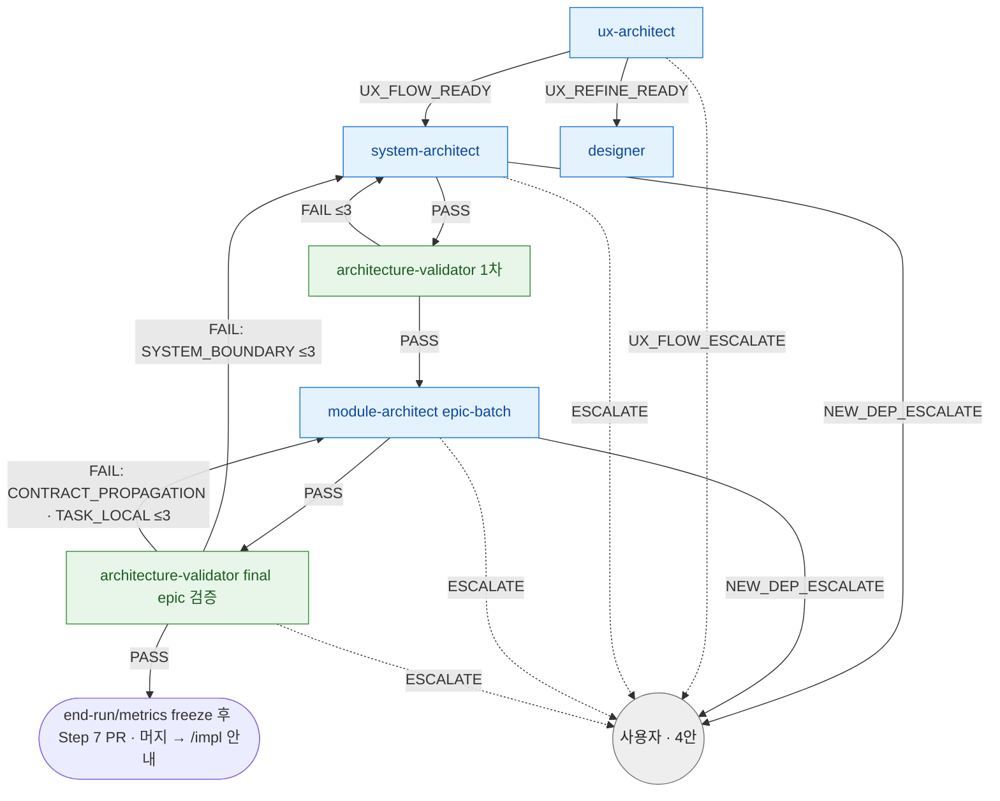

# design 분기 규칙 SSOT

> **Status**: ACTIVE
> **Scope**: `/design` skill **단일 전용** 분기 규칙 진본 — 이 skill 안 agent (ux-architect / system-architect / architecture-validator / module-architect / designer) 의 결론 → 다음 호출 + retry 한도 + escalate 처리. 진행 절차(Step) 는 [`SKILL.md`](SKILL.md).
> **Cross-ref**: 순서 차단 훅 보존 = [`hooks.md`](../../docs/plugin/hooks.md#catastrophic-gatesh) · 권한 경계 = [`agent_boundary.py`](../../harness/agent_boundary.py) · 용어 기준 = [`terms.md`](../../docs/plugin/terms.md).

## 읽는 법

agent 는 일을 마치면 prose 마지막 단락에 어떤 결과로 끝났는지와 사유를 자기 언어로 적는다. 메인 Claude 가 그 prose 를 읽고 아래 매핑으로 다음 호출을 정한다. 이 문서는 형식 강제가 아니라 판단 보조다. prose 가 모호하면 사용자에게 위임한다.

분기 규칙은 skill 이 소유한다. agent 는 결론(enum)만 내고, "그 결론이면 다음 누구" 는 본 문서가 정한다. 같은 agent 가 다른 skill 에 나와도 그건 그 skill 의 분기 규칙이지 본 문서 영역이 아니다.

## 분기 그래프

> 파랑 = 생산 agent · 초록 = 검증 agent · 회색 = 사용자 위임. 점선 = escalate. 엣지의 `≤N` = retry 한도 ([retry 한도](#retry-한도)).
>
> tech-reviewer 는 design 진입 *전* (`/tech-review` skill) 단계가 기본이다. design 중 새 외부 의존이 발견되면 사용자가 option 4 를 명시 선택한 경우에만 대상 epic 범위로 좁혀 호출한다.

## 결론 → 다음 호출 매핑

| agent | 결론 → 다음 호출 |
|---|---|
| **ux-architect** | `UX_FLOW_READY` → system-architect · `UX_REFINE_READY` → designer · `UX_FLOW_ESCALATE` → 사용자. (UI-less epic 이면 메인이 호출 안 함 — [`SKILL.md`](SKILL.md) UI-less 분기) |
| **system-architect** | `PASS` → architecture-validator(1차) · `ESCALATE` → `/spec` 재진입 또는 사용자 위임 · `NEW_DEP_ESCALATE` → 4안([escalate 처리](#escalate-처리)) |
| **architecture-validator** | `PASS`(1차) → module-architect(epic-batch) · `PASS`(final epic 검증) → SKILL.md Step 6 end-run/metrics freeze 후 Step 7 PR · `FAIL` → finding 분류별 재진입([finding 분류 분기](#finding-분류-분기)) · `ESCALATE` → 사용자 |
| **module-architect** | `PASS` → architecture-validator(final epic 검증) · `SPEC_GAP_FOUND` → module-architect(epic-batch) 보강([retry 한도](#retry-한도)) · `ESCALATE` → 사용자 · `NEW_DEP_ESCALATE` → 4안([escalate 처리](#escalate-처리)) |
| **designer** | `PASS` → 사용자 PICK · `ESCALATE` → 사용자. (UX_REFINE 분기 진입 시) |

표만으로 안 풀리는 맥락:

- **module-architect(epic-batch)** 는 공통 task와 전체 Story impl 산출물을 하나의 컨텍스트에서 일괄 작성한다. Story 단위 작성 주체로 쪼개지지 않으며, 모든 Story 에 단위 검증을 기본값으로 복원하지 않는다.
- **architecture-validator 시점** — 1차 = system 산출물 기준으로 요구사항 출처, 설계 표준, Contract Ledger 충분성, 구현 순서(첫 제품 경계 동작 앞당김), Flow Ownership Map, domain-model 작성/생략 근거, 계약 표면 코드 SSOT 대조 증거를 검토한다. final epic 검증 = 모든 impl 산출물을 한 번에 읽고 Story 간 compose/wiring, forward-ref 회수, Contract Ledger sweep, Story별 첫 제품 경계 동작 증거, cold-seat 구현 가능성, PRD origin 대조, impl 과상세화, 코드 SSOT drift 를 검토한다. Must finding 마다 분류(`SYSTEM_BOUNDARY` / `CONTRACT_PROPAGATION` / `TASK_LOCAL`) 동반.
- **규모 초과 사전 가드** — Step 4 전 Story 수와 예상 full design pack 규모가 target 1,500줄 / hard warning 2,000줄 예산을 넘을 전망이면, 메인은 자동 진행 대신 사용자에게 epic 분할 또는 예외적 batch 2분할을 위임한다. 이는 대형 epic 출력 한계 방지용 escape 이며 per-Story 검증 기본값 복원이 아니다.
- **고위험 추가 검증** — 보안·migration·public API breakage 같은 신호가 batch 작성 중 뒤늦게 드러나면 메인은 final epic 검증 전 추가 검토를 선택할 수 있다. 단 이것은 예외적 보강이지 옛 per-Story 검증 기본값의 복원이 아니다.

## finding 분류 분기

> drift 비용 분리의 핵심 — architecture-validator FAIL 을 "어느 레벨로 rollback?" 이 아니라 **finding 분류** 로 분기한다. 같은 FAIL 도 분류에 따라 비용이 크게 갈린다. 분류 진본 = [`agents/architecture-validator.md` finding 분류](../../agents/architecture-validator.md#finding-분류).

| finding 분류 | 뜻 | 재진입 대상 | 비고 |
|---|---|---|---|
| `SYSTEM_BOUNDARY` | 큰 그림(상위 경계)이 틀림 — 도메인 invariant / port 소비자 / usecase ownership / 전역 decision / storage policy / Flow Ownership Map / 기존 코드 계약 표면과의 상위 불일치 | **system-architect** 재진입 | 비싼 재설계. system 재진입의 기본 사유. |
| `CONTRACT_PROPAGATION` | 결정은 맞는데 stale 사본이 남았거나 신규 산출물에 Contract Ledger 전문 사본이 생김 | **module-architect `mode=contract_sweep`** | 포인터화 sweep. system 재설계 아님. canonical 행 키(진본 = Contract Ledger) + sweep 키워드를 prompt 로 전달한다. |
| `TASK_LOCAL` | 특정 impl task 문서만 틀림 — 예시 / depends_on / 수용기준 / requirements / Implementation Detail Leak / `risk`·`engine`·`수정 허용` 누락 | **module-architect(epic-batch)** 보강 | batch 컨텍스트를 유지해 같은 계열 task 를 함께 고친다. |

- system-architect 재진입은 `SYSTEM_BOUNDARY` 일 때 기본값이다. stale 문구 전파 누락 또는 전문 사본 제거는 `CONTRACT_PROPAGATION` 으로 처리(sweep), system 재설계로 끌어올리지 않는다.
- `CONTRACT_AMENDMENT` 은 분기 enum 이 아니다 — module-architect 가 public contract 를 바꿀 때 취하는 자연어 행동 의무 (Contract Ledger 갱신 / "변경 없음" 명시). 분기 결정은 위 3 분류로만 한다.

## retry 한도

| 재시도 경로 | 한도 | 초과 시 |
|---|---|---|
| ux-architect self-check FAIL → ux-architect 재진입 (prose 내부) | 2 cycle | 사용자 위임 |
| architecture-validator 1차 FAIL → system-architect | 3 cycle | 사용자 위임 |
| final epic 검증 FAIL → 산출 주체 재진입 | 3 cycle | 사용자 위임 |
| module-architect `SPEC_GAP_FOUND` → 보강 → 신규 케이스 재진입 | 3 cycle | 사용자 위임 |

> retry 한도는 문서상 장식이 아니라 실행 판단이다. 같은 경로가 표의 각 행에 적힌 한도를 초과하면 자동 복구하지 않고, 남은 finding·영향·선택지를 사용자에게 보고한다.
> 한도 초과 시 사용자 위임이 실제 다음 행동이다.
>
> **architecture-validator FAIL 재진입 대상 = finding 분류별** ([finding 분류 분기](#finding-분류-분기)) — 1차는 검증 대상이 system-architect 산출물이라 기본적으로 system-architect 재진입이다. final epic 검증은 `SYSTEM_BOUNDARY` → system-architect, `CONTRACT_PROPAGATION` → module-architect `mode=contract_sweep`, `TASK_LOCAL` → module-architect(epic-batch) 보강.
> cycle 발생 시 working tree only — commit X. PASS 후에만 commit.

> **finding 수용 자세** (점 패치 X, 근본 재설계) — 같은 영역 finding 이 2회+ 반복되면 점 패치 retry 로 한도를 소진하지 말고 근본 원인을 짚어 그 영역을 재설계한다. 진본 = [`loop-procedure.md` finding 수용 원칙](../../docs/plugin/loop-procedure.md#finding-수용-원칙-점-패치-금지-근본-수정).

## escalate 처리

escalate 계열 결론(`UX_FLOW_ESCALATE` / `ESCALATE` / `NEW_DEP_ESCALATE`) 수신 시 **메인이 즉시 사용자 보고 후 대기** (자동 복구 / 우회 / 재시도 금지 — [`../../CLAUDE.md`](../../CLAUDE.md) 강제 영역).

- **기술 스택 그릴미 미합의** (Step 2.9 — 사용자가 스택 결정 못 냄 / 보류) → loop 진행 보류 + 사용자 위임. 기록된 스택 결정이 실존하는 경우에는 확인 안내 후 skip 할 수 있지만, 적용 가능한 결정이 없는 첫 epic 에서 합의를 임의로 만든 것처럼 처리하지 않는다.
- system-architect 의 `ESCALATE` → 사용자(`/spec` 재진입). upstream PRD/요구사항 부족을 design 안에서 임의 복구하지 않는다.
- **`*_ESCALATE`** → 사용자 위임.

### NEW_DEP_ESCALATE — 4안 (단순 대기 아님)

system-architect / module-architect 가 design 도중 tech-review 미검증 새 외부 의존을 발견했을 때. loop 자동 중단 X. 메인이 사용자에게 4안 제시:

1. **채택 + 수동 검증** — 사용자 승인 → 해당 architect 재진입 (`docs/decisions/` 또는 epic architecture 에 "사용자 승인, tech-review 미경유" 흔적 명시)
2. **대안 기술 우회** — 이미 tech-review 검증된 대안 지정 → architect 재진입
3. **전체 원점 회귀** — `/design` 중단 + `/spec` 재진입 + 새 tech-review
4. **대상 epic 기술 검토** — 현재 `/design` 을 보류하고 tech-reviewer 를 대상 epic 범위로 호출. 산출은 `docs/epics/epic-NN-<slug>/tech-review.md`, evidence/HTML 은 `.dcness-work/reviews/`. PASS + 사용자 OK 후 해당 architect 재진입

(1)·(2)·(4) 재진입 cycle ≤ 3. (4)는 전역 `/tech-review` 재진입이 아니라 현재 epic 에 한정한 검토다. (3)은 `/spec` 으로 돌아가 전역 PRD와 preflight 를 다시 닫는다.

## 후속 (loop 종료 후)

- 본 loop clean → 자동 commit/PR + 머지 → 사용자에게 "`/impl <epic-path>` 로 구현 진입할까요?" 안내
- 주의사항 → 사용자 결정 (수동)
- spec gap 발견 + cycle 한도 초과 → 사용자 위임 (`/spec` 재진입 권고)
