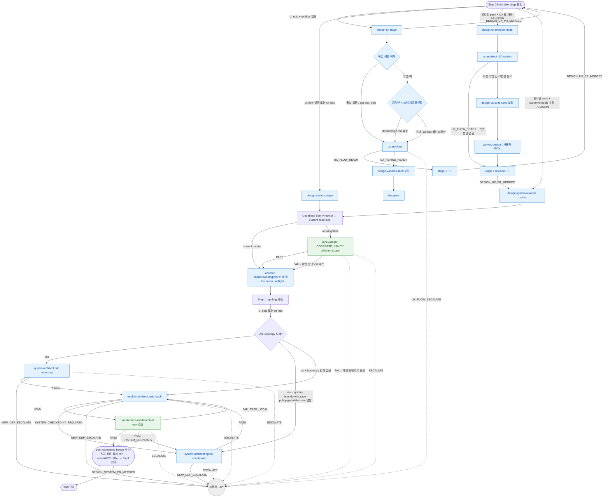

# design 분기 규칙 SSOT

> **Status**: ACTIVE
> **Scope**: `/design` skill **단일 전용** 분기 규칙 진본 — 이 skill 안 내부 stage(design-ux / design-system) 와 agent (ux-architect / system-architect(thin bootstrap/checkpoint) / module-architect / architecture-validator / designer) 의 결론 → 다음 호출 + retry 한도 + escalate 처리. 진행 절차(Step) 는 [`SKILL.md`](SKILL.md).
> **Cross-ref**: 순서 차단 훅 보존 = [`hooks.md`](../../docs/plugin/hooks.md#catastrophic-gatesh) · 권한 경계 = [`agent_boundary.py`](../../harness/agent_boundary.py) · 용어 기준 = [`terms.md`](../../docs/plugin/terms.md).

## 읽는 법

agent 는 일을 마치면 prose 마지막 단락에 어떤 결과로 끝났는지와 사유를 자기 언어로 적는다. 메인 Claude 가 그 prose 를 읽고 아래 매핑으로 다음 호출을 정한다. 이 문서는 형식 강제가 아니라 판단 보조다. prose 가 모호하면 사용자에게 위임한다.

분기 규칙은 skill 이 소유한다. agent 는 결론(enum)만 내고, "그 결론이면 다음 누구" 는 본 문서가 정한다. 같은 agent 가 다른 skill 에 나와도 그건 그 skill 의 분기 규칙이지 본 문서 영역이 아니다.

## 분기 그래프

```mermaid
flowchart TB
  START([Step 0.5 durable stage 판정]) -->|UI epic + ux-flow 없음| DUX[design-ux stage]
  START -->|ux-flow 있음 또는 UI-less| DSYS[design-system stage]
  START -->|완료된 pack + UX 층 개정 REVISION| DUX_REV[design-ux revision mode]
  START -->|완료된 pack + system/module 개정 REVISION| DSYS_REV[design-system revision mode]
  DUX -->|DESIGN_UX_PR_MERGED| START
  DUX_REV --> UX_REV[ux-architect UX revision]
  UX_REV -->|UX_FLOW_READY + 목업 변경 없음| UXPR_REV[stage 1 revision PR]
  UX_REV -->|확정 목업 신규/변경 필요| SEED_REV[design-variants seed 보장]
  SEED_REV --> CANVAS_REV[canvas-design / 사용자 PICK]
  CANVAS_REV --> UXPR_REV
  UXPR_REV -->|DESIGN_UX_PR_MERGED| DSYS_REV
  DSYS --> SANITY[Codebase Sanity receipt ↔ current code tree]
  DSYS_REV --> SANITY
  SANITY -->|current receipt| FRESH[affected capability/entrypoint 현재 코드 freshness preflight]
  SANITY -->|missing/stale| CSA[impl-validator CODEBASE_SANITY affected scope]
  CSA -->|PASS| FRESH
  CSA -->|FAIL · 메인 판단으로 계속| FRESH
  CSA -.->|FAIL · 메인 판단으로 중단| U
  CSA -.->|ESCALATE| U
  FRESH --> TOPO[Step 1 topology 판정]
  TOPO -->|UI epic 또는 UI-less| BOOT{모듈 topology 부재?}
  DUX --> MU{목업 선행 여부}
  MU -->|목업 없음 / opt-out / yolo| UX[ux-architect]
  MU -->|목업=예| DSKIP{디자인 시스템 체크포인트}
  DSKIP -->|docs/design.md 유효| UX
  DSKIP -->|부재 / ad-hoc 베이스라인| UX
  UX -->|UX_FLOW_READY| UXPR[stage 1 PR]
  UXPR -->|DESIGN_UX_PR_MERGED| START
  UX -->|UX_REFINE_READY| SEED[design-variants seed 보장]
  SEED --> DS[designer]
  BOOT -->|yes| SA_BOOT[system-architect thin bootstrap]
  BOOT -->|no + system boundary/storage policy/global decision 영향| SA_CHECK
  BOOT -->|no + boundary 변화 없음| MA_BATCH[module-architect epic-batch]
  SA_BOOT -->|PASS| MA_BATCH
  MA_BATCH -->|PASS| AV_FINAL[architecture-validator final epic 검증]
  MA_BATCH -->|SYSTEM_CHECKPOINT_REQUIRED| SA_CHECK[system-architect opt-in checkpoint]
  SA_CHECK -->|PASS| MA_BATCH
  AV_FINAL -->|PASS| M([end-run/metrics freeze 후 사용자 최종 설계 승인 · commit/PR · 머지 → /impl 안내])
  M -->|DESIGN_SYSTEM_PR_MERGED| DONE([/impl 안내])
  AV_FINAL -->|"FAIL: SYSTEM_BOUNDARY"| SA_CHECK
  AV_FINAL -->|"FAIL: TASK_LOCAL"| MA_BATCH
  SA_CHECK -->|NEW_DEP_ESCALATE| U((사용자 · 4안))
  SA_BOOT -->|NEW_DEP_ESCALATE| U
  MA_BATCH -->|NEW_DEP_ESCALATE| U
  UX -.->|UX_FLOW_ESCALATE| U
  SA_BOOT -.->|ESCALATE| U
  SA_CHECK -.->|ESCALATE| U
  MA_BATCH -.->|ESCALATE| U
  AV_FINAL -.->|ESCALATE| U

  classDef produce fill:#e3f2fd,stroke:#1976d2,color:#0d47a1
  classDef verify fill:#e8f5e9,stroke:#388e3c,color:#1b5e20
  classDef user fill:#eeeeee,stroke:#757575,color:#212121
  class DUX,DUX_REV,DSYS,DSYS_REV,FRESH,UX,UX_REV,UXPR,UXPR_REV,SA_BOOT,SA_CHECK,DS,MA_BATCH,SEED,SEED_REV,CANVAS_REV,MU,DSKIP produce
  class CSA,AV_FINAL verify
  class U user
```

> 파랑 = 생산 agent · 초록 = 검증 agent · 회색 = 사용자 위임. 점선 = escalate. FAIL 엣지를 다시 돌지는 횟수가 아니라 [재시도 판단](#재시도-판단)으로 정한다. `SYSTEM_BOUNDARY` / `TASK_LOCAL` final FAIL 엣지는 하나의 재시도 이력으로 읽는다.
>
> tech-reviewer 는 design 진입 *전* (`/tech-review` skill) 단계가 기본이다. design 중 새 외부 의존이 발견되면 사용자가 option 4 를 명시 선택한 경우에만 대상 epic 범위로 좁혀 호출한다.

- **UX revision 목업 경로**: 화면 통합/분할/삭제로 확정 목업 신규/변경이 필요하면 `design-ux` revision mode 안에서도 design-variants seed 보장 → canvas-design / 사용자 PICK → stage 1 revision PR 순서를 거친다. 목업 변경이 없으면 UX revision PR 로 직행한다.

## 결론 → 다음 호출 매핑

| agent | 결론 → 다음 호출 |
|---|---|
| **design-ux stage** | `DESIGN_UX_PR_MERGED` → `/design` dispatcher 재판정. 신규 UX stage 는 durable `ux-flow.md` 존재 + full design pack 부재이면 design-system stage, UX revision mode 는 stage 1 revision PR 뒤 design-system revision mode · `ESCALATE` → 사용자 |
| **design-system stage** | `DESIGN_SYSTEM_PR_MERGED` → `/impl <epic-path>` 안내 · `ESCALATE` → 사용자 |
| **impl-validator:CODEBASE_SANITY** | stale/missing receipt의 affected scope `PASS` → 메인이 현재 tree identity receipt를 local 경로에 보존하고 Cartography freshness preflight · `FAIL` → 설계 진입을 막지 않는다. 메인이 finding과 이번 설계의 관련성을 판단해 계속(finding을 설계 agent 입력으로 전달하고 Cartography freshness preflight) 또는 중단하고, 그 이유를 사용자에게 보고 · `ESCALATE` → 사용자 |
| **ux-architect** | `UX_FLOW_READY` → 사용자 최종 설계 승인 후 stage 1 PR 생성 → `/design` dispatcher 재판정 · `UX_REFINE_READY` → design-variants seed 보장 후 designer · `UX_FLOW_ESCALATE` → 사용자. (UI-less epic 이면 메인이 호출 안 함 — [`SKILL.md`](SKILL.md) UI-less 분기) |
| **module-architect** | `PASS` → architecture-validator(final epic 검증) · `SYSTEM_CHECKPOINT_REQUIRED` → system-architect opt-in checkpoint · `SPEC_GAP_FOUND` → module-architect(epic-batch) 보강([재시도 판단](#재시도-판단)) · `ESCALATE` → 사용자 · `NEW_DEP_ESCALATE` → 4안([escalate 처리](#escalate-처리)) |
| **system-architect(thin bootstrap)** | `PASS` → module-architect(epic-batch) · `ESCALATE` → `/spec` 재진입 또는 사용자 위임 · `NEW_DEP_ESCALATE` → 4안([escalate 처리](#escalate-처리)) |
| **system-architect(opt-in checkpoint)** | `PASS` → module-architect(epic-batch) · `ESCALATE` → `/spec` 재진입 또는 사용자 위임 · `NEW_DEP_ESCALATE` → 4안([escalate 처리](#escalate-처리)) |
| **architecture-validator** | `PASS`(final epic 검증) → SKILL.md Step 5 end-run/metrics freeze 후 사용자 최종 설계 승인 + commit/PR · `FAIL` → finding 분류별 재진입([finding 분류 분기](#finding-분류-분기)) · `ESCALATE` → 사용자 |
| **designer** | `PASS` → 사용자 PICK · `ESCALATE` → 사용자. (UX_REFINE 분기 진입 시) |

표만으로 안 풀리는 맥락:

- **Codebase Sanity receipt freshness** — `dcness-helper sanity-receipt-dir --project-root "$PROJECT_ROOT"`로 primary-worktree `.dcness-work/codebase-sanity/` local-only/ignored 경로를 해석해 `ExitWorktree` 뒤에도 남은 receipt의 code revision/tree identity를 현재 code tree와 대조한다. 같으면 재사용한다. 다르면 무조건 무효로 보지 않고, 메인이 receipt의 revision부터 현재까지의 변경분을 읽어 그 변경이 이번 epic의 affected scope와 그 scope가 의존하는 빌드 설정·의존성·공유 모듈에 닿는지 판단한다. 닿지 않는다는 근거를 댈 수 있으면 receipt를 재사용하고 그 이유를 남긴다. 닿으면 닿는 명령의 exit/warning만 다시 수집해 `impl-validator:CODEBASE_SANITY`를 affected scope로 재감사한다. receipt가 없거나 변경분을 계산할 수 없거나 영향이 넓으면 전체 명령을 다시 수집한다. 판단 기준은 [`rerun-judgment.md`](../../docs/plugin/agents/_shared/rerun-judgment.md) 다. receipt는 canonical Root refresh 완료 또는 affected capability/entrypoint 현재 코드 대조를 대신하지 않는다.
- **Cartography freshness preflight** — stories·Root·관련 global decision에서 affected capability/entrypoint를 식별하고 현재 코드의 runtime entrypoint와 wiring 증거에 대조한다. system boundary, storage policy, shared public boundary, global decision 변경이 명백하면 system checkpoint로 선승격한다. boundary 없는 route/state 갱신은 별도 Cartography 전용 system-architect로 우회하지 않고 module-architect가 bounded하게 처리한다. 놓친 영향은 기존 `SYSTEM_CHECKPOINT_REQUIRED`와 final `SYSTEM_BOUNDARY` finding으로 회수한다.
- **system-architect(thin bootstrap)** 는 greenfield 첫 설계에서 모듈 topology 가 전혀 없을 때만 module-architect 앞에 1회 들어간다. 산출은 큰 모듈 목록(책임 + 공개 인터페이스 한 줄), 의존 그래프, 스택/전역 decision 기록으로 제한한다. bootstrap 뒤 architecture-validator 를 끼우지 않고 바로 module-architect 로 간다.
- **module-architect(epic-batch)** 는 공통 task와 전체 Story impl 산출물을 하나의 컨텍스트에서 일괄 작성한다. Story 단위 작성 주체로 쪼개지지 않으며, 모든 Story 에 단위 검증을 기본값으로 복원하지 않는다.
- **architecture-validator 시점** — final epic 검증만 기본이다. 모든 impl 산출물을 한 번에 읽고 Story AC ↔ REQ origin 대조, 미커버 AC·무출처 REQ·마지막 task 종합 검증, Story 간 compose/wiring, forward-ref 회수, Story별 첫 제품 경계 동작 증거, 구현 순서(첫 제품 경계 동작 앞당김), cold-seat 구현 가능성, impl 과상세화, 코드 SSOT drift 를 검토한다. Must finding 마다 분류(`SYSTEM_BOUNDARY` / `TASK_LOCAL`) 동반. ux-flow·stories prose 같은 비규범 요약 층의 stale 은 형식만으로 FAIL 하지 않고 Should 로 보고한다.
- **완료된 pack 개정 REVISION** — `/design <epic> --revise` 또는 대화 맥락의 명시 개정 신호가 있으면 full design pack 이 완료됐더라도 revision mode 로 들어간다. 화면 통합·분할·삭제, `ux-flow.md`, 확정 목업, `docs/design.md` 토큰처럼 UX 산출물 자체를 바꾸는 신호는 `design-ux` revision mode 로 먼저 들어간다. stage 1 revision 이 끝나면 메인이 UX 변경분을 읽고 그 변경이 architecture·decision·impl task 에 닿는지 판단한다. 닿거나 불확실하면 `design-system` revision mode 로 전파하고, 닿지 않는다는 근거를 댈 수 있으면(예: 산출물이 이름으로 참조하는 토큰의 값만 바뀐 경우) 전파하지 않고 그 이유를 stage 1 PR 에 남긴다. 구조·모듈·ADR·impl task 개정 신호는 곧장 `design-system` revision mode 로 들어간다. REVISION 은 완료 판정을 깨는 오류가 아니라 완료된 pack 개정 경로다. 개정 의도가 없으면 완료 pack 은 `/impl` 안내가 기본이다. 단, stage 1 revision 이 남긴 `docs/epics/<epic>/revision-pending.md` 는 개정 의도의 durable 표현이므로, 인자나 대화 신호 없이도 `design-system` revision mode 로 들어간다 — 그 표식이 있는 epic 은 "개정 의도 없음" 이 아니다.
- **revision mode 원칙** — ux-architect 는 UX 층 revision 에서 영향 UX 산출물만 개정하고 system/module 산출물을 직접 수정하지 않는다. module-architect 는 system/module revision 에서 surgical revision 으로 영향 산출물만 개정하고 미변경 impl task 를 보존한다. final validator 는 개정분과 그 개정이 닿는 산출물을 스스로 골라 검증하고, 영향이 넓거나 불확실하면 개정 후 전체 설계 pack 정합으로 범위를 올린다. 파생 drift 체크리스트는 닿는 범위를 찾는 증거 포인터다. 다시 검토하지 않은 산출물은 이유를 적는다. 메인은 범위를 좁혀 처방하지 않고 전체로 올리는 것도 막지 않는다.
- **stage PR 경계** — `DESIGN_UX_PR_MERGED` 는 UX 산출물이 main 에 durable 해졌다는 신호다. dispatcher 는 같은 `/design` 공개 진입점으로 재판정해 system stage 로 이어간다. `DESIGN_SYSTEM_PR_MERGED` 는 full design pack 이 durable 해졌다는 신호이므로 `/impl` 로 넘어간다.
- **목업 선행 여부 checkpoint** — UI epic 의 `design-ux` stage 는 ux-architect 호출 전에 목업 선행 여부를 1회 묻는다. 목업 없음 / opt-out / yolo 는 기존 흐름을 유지하고, 목업=예 는 디자인 시스템 체크포인트와 canvas-design 사용자 PICK 을 먼저 닫는다. 사용자 PICK 확정 이후에만 design-system stage 로 넘어간다.
- **목업 미참조 금지** — `design-system` stage 는 확정 목업이 있는 UI epic 에서 확정 목업 경로, node-id 매핑, `docs/design.md` 토큰을 module-architect 와 architecture-validator 입력에 넣는다. 산출물이 목업 미참조 상태면 final epic 검증 PASS 로 처리하지 않고 finding 분류에 따라 module-architect 또는 system checkpoint 로 되돌린다.
- **규모 초과 사전 가드** — 작성·개정 전과 매 agent 실행 직후의 규모 판단은 [`SKILL.md`](SKILL.md#실행-직후-분량과-개정-규모)를 따른다. 결정 문서를 포함한 수치는 경고이며 숫자만으로 FAIL하지 않는다. 요청 대비 과도하면 삭제·단순화·위임·범위 축소를 먼저 제시하고, 큰 epic은 분할 또는 예외적 batch 2분할도 검토한다. 이는 대형 epic 출력 한계 방지용 escape 이며 per-Story 검증 기본값 복원이 아니다.
- **고위험 추가 검증** — 보안·migration·public API breakage 같은 신호가 batch 작성 중 뒤늦게 드러나면 메인은 final epic 검증 전 추가 검토를 선택할 수 있다. 단 이것은 예외적 보강이지 옛 per-Story 검증 기본값의 복원이 아니다.

## finding 분류 분기

> drift 비용 분리의 핵심 — architecture-validator FAIL 을 "어느 레벨로 rollback?" 이 아니라 **finding 분류** 로 분기한다. 같은 FAIL 도 분류에 따라 비용이 크게 갈린다. 분류 진본 = [`agents/architecture-validator.md` finding 분류](../../agents/architecture-validator.md#finding-분류).

| finding 분류 | 뜻 | 재진입 대상 | 비고 |
|---|---|---|---|
| `SYSTEM_BOUNDARY` | 큰 그림(상위 경계)이 틀림 — 도메인 invariant / port 소비자 / usecase ownership / 기존 전역 decision / storage policy / public API boundary / 기존 코드 계약 표면과의 상위 불일치 | **system-architect opt-in checkpoint** | 비싼 재설계. system checkpoint 의 기본 사유. |
| `TASK_LOCAL` | 특정 impl task 문서만 틀림 — 예시 / depends_on / 수용기준 / requirements / Implementation Detail Leak / `risk`·`engine`·`수정 허용` 누락 | **module-architect(epic-batch)** 보강 | batch 컨텍스트를 유지하되 실제로 같은 원인이 닿는 task만 고친다. |

- system-architect 재진입은 `SYSTEM_BOUNDARY` 일 때만 기본값이다. stale 문구 전파 누락과 ux-flow/stories 요약 drift 는 형식만으로 system 재설계로 끌어올리지 않는다.
- `CONTRACT_AMENDMENT` 은 분기 enum 이 아니다 — module-architect 가 public contract 를 바꿀 때 취하는 자연어 행동 의무 (module responsibility / decision 갱신 또는 "변경 없음" 명시). 분기 결정은 위 2 분류로만 한다.

## 재시도 판단

재시도 경로는 다음 네 가지다. 어느 경로에도 숫자 한도는 없다. 다시 돌지는 메인이 [`rerun-judgment.md`](../../docs/plugin/agents/_shared/rerun-judgment.md) 기준으로 수렴 여부를 읽어 정한다.

| 재시도 경로 | 다시 도는 조건 | 멈추면 |
|---|---|---|
| ux-architect self-check FAIL → ux-architect 재진입 (prose 내부) | 직전 대비 지적이 줄거나 좁아진다 | 사용자 위임 |
| final epic 검증 FAIL → 산출 주체 재진입 | 같은 영역 지적이 수렴한다 | 사용자 위임 |
| module-architect `SYSTEM_CHECKPOINT_REQUIRED` → system checkpoint → epic-batch 재진입 | checkpoint 가 새 경계 결정을 닫았다 | 사용자 위임 |
| module-architect `SPEC_GAP_FOUND` → 보강 → 신규 케이스 재진입 | 보강이 직전 gap 을 닫았다 | 사용자 위임 |

> 재시도 판단은 문서상 장식이 아니라 실행 판단이다. 다시 돌기 전에 "이번 재진입은 직전과 무엇이 다르고, 어떤 결과가 나오면 수렴으로 보는가"에 답한다. 답이 없으면 자동 복구하지 않고, 남은 finding·영향·선택지를 사용자에게 보고한다.
> thin bootstrap 은 retry loop 가 아니라 topology 부재 판정 때 1회만 들어가는 선행 산출이다. 실패하면 사용자에게 위임하고, bootstrap 산출물 검증을 위한 별도 architecture-validator 단계는 만들지 않는다.
>
> **architecture-validator FAIL 재진입 대상 = finding 분류별** ([finding 분류 분기](#finding-분류-분기)) — final epic 검증은 `SYSTEM_BOUNDARY` → system-architect opt-in checkpoint, `TASK_LOCAL` → module-architect(epic-batch) 보강.
> 재진입 중에는 working tree only — commit X. final PASS 뒤에도 사용자 최종 설계 승인 전에는 commit X.

### final 검증 재시도 이력 계약

**RCA**: Android `/design` 관측에서는 final 검증 FAIL 후 새 stale 사본 finding 이 나올 때마다 "같은 경로" 판단이 흐려졌고, 그래프의 `SYSTEM_BOUNDARY` / `TASK_LOCAL` 양쪽 edge 를 서로 다른 재시도로 읽을 여지도 있었다. 그 결과 사용자 위임으로 전환되지 못하고 같은 검증이 6회 자동으로 다시 돌았다. 숫자 한도는 이 사고를 막지 못했다. 원인은 한도 값이 아니라 "새 finding 이 나왔다"를 "설계가 수렴한다"로 읽은 판단이었다.

- **final epic 검증 FAIL → 산출 주체 재진입의 재시도 이력은 하나**다. `SYSTEM_BOUNDARY` 는 system-architect opt-in checkpoint, `TASK_LOCAL` 은 module-architect(epic-batch) 보강으로 가지만 둘은 같은 이력에 쌓인다.
- **분류만 바꿔 계속 재시도하지 않는다.** `SYSTEM_BOUNDARY` / `TASK_LOCAL` 분류 전환, finding 영역 변경, 파일 변경, finding 수 변화, 새 finding 등장, provider 변경은 이력을 새로 시작하는 근거가 아니다.
- **수렴을 읽는다.** 직전 검증 대비 Must finding 이 줄거나 한 영역으로 좁아지면 진전이므로 재진입한다. 같은 영역 finding 이 다시 나오거나, 고친 만큼 새 finding 이 다른 사본에서 계속 나오면 수렴하지 않는 것이다. 이때는 점 수정으로 다시 돌지 않고 그 영역의 근본 원인을 재검토하거나, 진행을 멈추고 남은 finding·영향·선택지(단순화 / 범위 축소 / 구현자 위임 / 결과 수용 / system checkpoint 계속 / module 보강 계속 / `/spec` 재진입 / hold)와 누적 재진입 횟수를 사용자에게 위임한다.
- **재검증 범위는 validator 가 고른다.** 한 task 문서만 보강했으면 validator 는 그 보강과 그것이 닿는 산출물·판단 축을 다시 보고, 닿지 않는 산출물은 이유를 적고 다시 보지 않는다. 영향이 넓거나 직전 결과와의 연결을 믿을 수 없으면 validator 가 스스로 전체 재검증으로 올린다. 메인은 직전 finding, 직전 검증 결과, 보강된 파일 목록을 입력으로 주고 범위는 처방하지 않는다.
- Claude Agent 와 Codex wrapper 모두 메인이 이력을 읽는다. Codex wrapper 는 end-step 까지 수행하지만 재시도 판단의 소유자가 아니다. 이력의 근거는 `architecture-validator`, `architecture-validator-1` 같은 같은 agent occurrence 와 ledger receipt 이며, provider field 는 이력을 나누는 기준이 아니다.
- 루프 재구성 이후 상설 초기 검증 stage 가 없어져도 이 계약은 남는다. 적용 대상은 design-system stage 의 final epic 검증과 그 FAIL 이 유발하는 system checkpoint 또는 epic-batch 재진입이다.

> **finding 수용 자세** — 반복 finding은 근본 원인을 재검토하되, 구조적 누수 증거가 없으면 범위를 넓히지 않는다. 보강 전에 단순화·범위 축소·구현자 위임·결과 수용도 검토한다. 결과 수용으로 사용자 약속이나 데이터·보안 위험을 바꾸면 사용자 결정이 필요하다. 요청하지 않은 제품 실행 동작은 설계 agent가 쓰기 전에 메인이 사용자에게 확인한다. 진본 = [`loop-procedure.md` finding 수용 원칙](../../docs/plugin/loop-procedure.md#finding-수용-원칙-점-패치-금지-근본-수정).

## escalate 처리

escalate 계열 결론(`UX_FLOW_ESCALATE` / `ESCALATE` / `NEW_DEP_ESCALATE`) 수신 시 **메인이 즉시 사용자 보고 후 대기** (자동 복구 / 우회 / 재시도 금지 — [`CLAUDE.md`](https://github.com/Daeguk-Sun/dcNess/blob/main/CLAUDE.md) 강제 영역).

- **기술 스택 그릴미 미합의** (Step 2.9 — 사용자가 스택 결정 못 냄 / 보류) → loop 진행 보류 + 사용자 위임. 기록된 스택 결정이 실존하는 경우에는 확인 안내 후 skip 할 수 있지만, 적용 가능한 결정이 없는 첫 epic 에서 합의를 임의로 만든 것처럼 처리하지 않는다.
- system-architect 의 `ESCALATE` → 사용자(`/spec` 재진입). upstream PRD/요구사항 부족을 design 안에서 임의 복구하지 않는다.
- **`*_ESCALATE`** → 사용자 위임.

### NEW_DEP_ESCALATE — 4안 (단순 대기 아님)

system-architect / module-architect 가 design 도중 tech-review 미검증 새 외부 의존을 발견했을 때. loop 자동 중단 X. 메인이 사용자에게 4안 제시:

1. **채택 + 수동 검증** — 사용자 승인 → 해당 설계 agent 재진입 (`docs/decisions/` 또는 epic architecture 에 "사용자 승인, tech-review 미경유" 흔적 명시)
2. **대안 기술 우회** — 이미 tech-review 검증된 대안 지정 → 설계 agent 재진입
3. **전체 원점 회귀** — `/design` 중단 + `/spec` 재진입 + 새 tech-review
4. **대상 epic 기술 검토** — 현재 `/design` 을 보류하고 tech-reviewer 를 대상 epic 범위로 호출. 산출은 `docs/epics/epic-NN-<slug>/tech-review.md`, evidence/HTML 은 `.dcness-work/reviews/`. PASS + 사용자 OK 후 해당 설계 agent 재진입

(1)·(2)·(4) 재진입을 반복할지는 [재시도 판단](#재시도-판단)으로 정한다 — 이 경로의 재진입 기준은 본 문서 한 곳이 소유한다. (4)는 전역 `/tech-review` 재진입이 아니라 현재 epic 에 한정한 검토다. (3)은 `/spec` 으로 돌아가 전역 PRD와 preflight 를 다시 닫는다.

## 후속 (loop 종료 후)

- 본 loop clean → 사용자 최종 설계 승인 → commit/PR + 머지 → 사용자에게 "`/impl <epic-path>` 로 구현 진입할까요?" 안내
- 주의사항 → 사용자 결정 (수동)
- spec gap 발견 + 재시도가 수렴하지 않음 → 사용자 위임 (`/spec` 재진입 권고)
