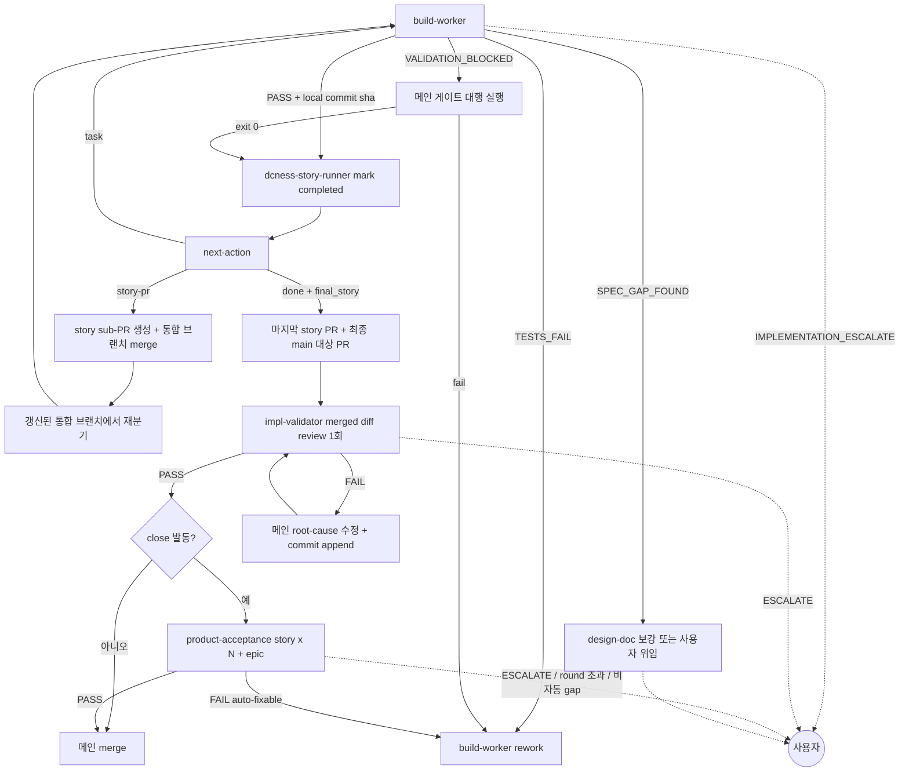

# impl-loop 분기 규칙 SSOT

> **Status**: ACTIVE
> **Scope**: `/impl-loop` skill 전용. 단일 구현 엔진 `build-worker`, merge candidate reviewer `impl-validator`, inline `product-acceptance` 의 결론 → 다음 호출 + retry 한도 + escalate 처리를 정한다. 진행 절차는 [`SKILL.md`](SKILL.md).

## 읽는 법

agent 는 prose 마지막 단락에 결론과 사유를 적는다. 메인 Claude 가 prose 를 읽고 아래 매핑으로 다음 행동을 정한다. 이 문서는 형식 강제가 아니라 판단 보조다. prose 가 모호하면 사용자에게 위임한다.

분기 규칙은 skill 이 소유한다. agent 는 결론만 내고, 그 결론이면 다음 누구를 호출하는지는 본 문서가 정한다.

## 분기 그래프

canvas-design 은 UI 작업의 main-owned checkpoint 이며 helper begin/end-step 비대상이다. draft 가 필요할 때 실제 Agent 호출은 `begin-step designer` 로 연다. `canvas-design PASS` 뒤에는 같은 `build-worker` 경로로 들어간다.

## 결론 → 다음 호출

| step | 결론 → 다음 |
|---|---|
| **build-worker** | `PASS` + local commit sha + clean status → `dcness-story-runner mark --status completed --commit <sha>` 후 `next-action` · `TESTS_FAIL` → build-worker rework(≤3) · `SPEC_GAP_FOUND` → design-doc 보강 또는 사용자 위임 · `VALIDATION_BLOCKED` → 메인이 같은 worktree cwd 에서 worker 가 남긴 검증 명령 실행, exit 0 이면 PASS 와 동일, 실패면 build-worker rework(≤3), 메인도 실행 불가면 사용자 위임 · `IMPLEMENTATION_ESCALATE` → 사용자 |
| **dcness-story-runner `next-action`** | `task` → 다음 task build-worker · `story-pr` → 직전 story sub-PR 생성·통합 브랜치 merge 후 응답의 `next_task` 를 갱신된 통합 브랜치에서 재분기 · `done` → `final_story` PR 경계를 처리하고 최종 main 대상 PR 생성 + impl-validator · `blocked` / `error` → task note 를 근거로 retry 한도 내 재시도 또는 사용자 위임 |
| **impl-validator** | merged diff `PASS` → close 발동 여부 확인 · `FAIL`(`[spec-gap]` 또는 `[quality-gap]`) → 메인 root-cause 수정. 단일 story PR 은 commit append, story PR 이 2개 이상이거나 이미 머지된 뒤라면 downstream rebase 없이 통합 fix PR 1개 + 재리뷰(≤3) · `ESCALATE` → 사용자 |
| **product-acceptance** | `PASS` → merge 진행. story×N 과 epic 대상이면 모두 PASS 필요 · `FAIL` auto-fixable gap → build-worker rework + commit append + impl-validator 재리뷰 + acceptance 재검수(≤3) · `FAIL` 비자동 gap / round 초과 / `ESCALATE` → 사용자 |

## retry 한도

| 재시도 경로 | 한도 | 초과 시 |
|---|---|---|
| build-worker `TESTS_FAIL` 또는 메인 게이트 대행 실패 | 3 | 사용자 위임 |
| impl-validator `FAIL` → 메인 root-cause 수정 → 재리뷰 | 3 | 사용자 위임 |
| product-acceptance `FAIL` auto-fixable gap → rework → 재검수 | 3 | 사용자 위임 |
| `SPEC_GAP_FOUND` design-doc 보강 | 1 | 사용자 위임 또는 `/design` 회수 |

finding 수용 원칙: 같은 파일·주제·위험 클래스 finding 이 반복되면 점 패치가 아니라 root cause 를 재검토한다. 설계가 부족하면 `/design` 으로 회수한다.

## 마감 acceptance 분기

story/epic close 를 실제 발동하는 PR 의 impl-validator `PASS` 후 · merge 전 product-acceptance 검수를 끼운다. 기본 ON, `--no-acceptance` 명시 run 만 비대상이다.

impl-validator 는 계획 대비 구현 정합과 merge candidate diff 위험을 검토한다. 여러 PR 이 합쳐진 story 동작과 여러 story 가 합쳐진 epic 동작의 사용자 관찰 가능 동작은 마감 product-acceptance 가 맡는다.

여러 task commit 이 합쳐진 story 동작은 story PR 과 acceptance 증거를 함께 보고 판정한다. 여러 story sub-PR 이 합쳐진 epic 동작도 같은 원칙으로 product-acceptance 가 맡는다. product-acceptance 는 개별 task green 이 아니라 story/epic close 시점의 사용자 동작 전체를 검수한다.

- story close: `STORY_ACCEPTANCE`
- 여러 story close: `STORY_ACCEPTANCE` 를 story × N
- epic close: 모든 story PASS 뒤 `EPIC_ACCEPTANCE`

gap 수정 commit 이 생겼으면 마지막 acceptance gap 수정 commit 이후의 PASS 만 clean 증거다. 이전 PASS 는 stale 이므로 STORY_ACCEPTANCE 부터 다시 돌린다.

auto-fixable gap: PRD/AC 미충족, 검수 증거 부족, 스모크 실패, mock-only green / 동작 증거 부족, 화면 증거 부재, 사용자 동선 부적합 / 내부 계약 노출, 구현 보강으로 닫히는 목업 불일치, 명확한 사용자 동선 보강. 비자동 gap: 설계 결함, 범위 재정의, 사용자/UX 선택 필요, 보안/권한/데이터 리스크.

## clean / blocked 판정

- task clean = build-worker PASS + phase prose 3개 + local commit sha + clean status + story-runner mark.
- story boundary clean = 해당 story 의 모든 task completed + story PR 생성. 다중 story 면 통합 브랜치 merge + 다음 branch 재분기까지 확인.
- integrated review clean = 모든 target task completed + 모든 story PR 경계 처리 + 최종 main 대상 PR 생성 + impl-validator PASS.
- close 발동 clean = integrated review clean + 필요한 product-acceptance PASS.
- verify-only clean = 검증 명령 exit 0 + 변경 0 + validator PASS.

false-clean 의심 시 blocked. 예: phase prose 부재, commit sha 부재, 검증 미실행, impl-validator PASS 부재, acceptance PASS 부재, PR/merge 흔적 부재.

## escalate 처리

`IMPLEMENTATION_ESCALATE`, `ESCALATE`, retry 한도 초과, 비자동 acceptance gap 은 즉시 사용자 보고 후 대기한다. 자동 복구 / 우회 / 재시도 금지.

## 후속

clean → 5줄 요약 + 전체 완료 보고. 전체 완료 뒤 자율 작업(이슈 등록 / cleanup / 분석)으로 이어가면 진입 전 `post-task-begin` marker 를 호출해 task ROI 측정을 분리한다 (#472). error/blocked → 남은 finding, 실패 명령, 다음 판단 지점을 보고한다.
