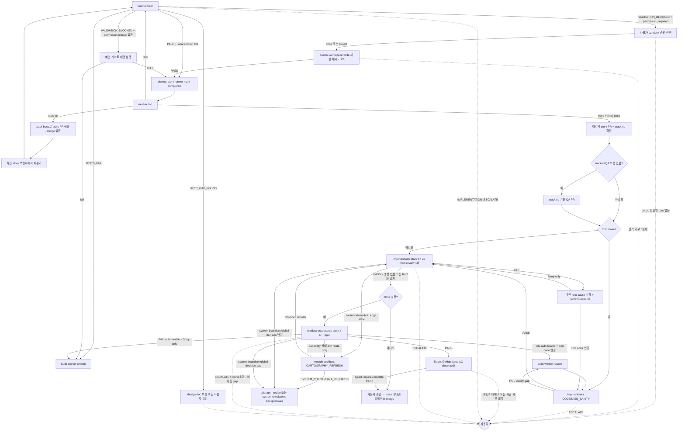

# impl-loop 분기 규칙 SSOT

> **Status**: ACTIVE
> **Scope**: `/impl-loop` skill 전용. 단일 구현 엔진 `build-worker`, merge candidate reviewer `impl-validator`, inline `product-acceptance` 의 결론 → 다음 호출 + retry 한도 + escalate 처리를 정한다. 진행 절차는 [`SKILL.md`](SKILL.md).

## 읽는 법

agent 는 prose 마지막 단락에 결론과 사유를 적는다. 메인 Claude 가 prose 를 읽고 아래 매핑으로 다음 행동을 정한다. 이 문서는 형식 강제가 아니라 판단 보조다. prose 가 모호하면 사용자에게 위임한다.

분기 규칙은 skill 이 소유한다. agent 는 결론만 내고, 그 결론이면 다음 누구를 호출하는지는 본 문서가 정한다.

## 분기 그래프

canvas-design 은 UI 작업의 main-owned checkpoint 이며 helper begin/end-step 비대상이다. draft 가 필요할 때 실제 Agent 호출은 `begin-step designer` 로 연다. `canvas-design PASS` 뒤에는 같은 `build-worker` 경로로 들어간다.

## 결론 → 다음 호출

| step | 결론 → 다음 |
|---|---|
| **build-worker** | `PASS` + local commit sha + clean status → `dcness-story-runner mark --status completed --commit <sha>` 후 `next-action` · `TESTS_FAIL` → build-worker rework(≤3) · `SPEC_GAP_FOUND` → design-doc 보강 또는 사용자 위임 · `VALIDATION_BLOCKED` + `permission_required` → outbound network 범위·제안 root·근거·`workspace-write` 유지·`danger-full-access` 미사용을 설명하고 사용자에게 이번 실행에만 허용/이 프로젝트에 저장/거부 선택 요청. 승인하면 Codex만 1회 제한 재시도, 거부·malformed settings·안전한 root 없음·반복 sandbox 거부면 권한 확대/host 직접 검증/다른 provider 우회 없이 사용자 위임 · permission receipt 없음 → 메인이 같은 worktree cwd에서 worker 검증 명령 실행, exit 0이면 PASS와 동일, 실패면 build-worker rework(≤3), 메인도 실행 불가면 사용자 위임 · `IMPLEMENTATION_ESCALATE` → 사용자 |
| **dcness-story-runner `next-action`** | `task` → 다음 task build-worker · `story-pr` → 응답의 `pr_base`로 직전 story PR 생성, merge 없이 `next_branch_base`의 직전 story 브랜치에서 재분기 · `done` → `final_story` PR 경계를 처리하고 `stack_tip` vs main candidate + 조건부 QA PR로 impl-validator · `blocked` / `error` → task note를 근거로 retry 한도 내 재시도 또는 사용자 위임 |
| **impl-validator:CODEBASE_SANITY** | Epic close final candidate에서만 실행. 작은 repo는 전체 repo, 큰 repo는 affected module과 affected dependency cone + cheap global signals · `PASS` → local receipt 보존 후 일반 merge review · `FAIL [quality-gap]` → build-worker rework 후 새 code revision에서 Sanity 재감사(≤3) · `ESCALATE` → 사용자 |
| **impl-validator** | stack tip vs main diff `PASS` → close 발동 여부 확인 · `FAIL`(`[spec-gap]` 또는 `[quality-gap]`) → 메인 root-cause 수정. 단일 story는 해당 PR append, story PR 이 2개 이상이면 story-local FAIL은 해당 story PR 브랜치 append + downstream restack, cross-cutting FAIL은 QA PR 흡수 + 재리뷰(≤3) · `ESCALATE` → 사용자 |
| **Cartography freshness** | build-worker Cartography impact + merge candidate diff + affected Root Cartography + 관련 epic/decision이 `영향 없음 또는 Root와 일치` → 기존 경로 · route/state/as-built edge stale → `module-architect:CARTOGRAPHY_REFRESH` bounded refresh + impl-validator 재검증 · system boundary/global decision 변경 → `/design --revise` 또는 system checkpoint backpressure |
| **product-acceptance** | 최종 tip에서 story×N + epic을 per-story verdict로 판정. `PASS` → target GitHub issue AC close audit. 1-story fix는 본 PR append, N-story tracked cross-cutting fix/flow 보정은 QA PR 흡수 · Epic code 변경은 완료된 Sanity/impl-validator 증거를 stale 처리하고 Sanity부터 재진입, Story-only는 impl-validator 재리뷰 + acceptance 재검수(≤3) · capability 상태 drift가 route-only stale → `CARTOGRAPHY_REFRESH` + 같은 diff+갱신 Root impl-validator 재검증 + acceptance 재검수 · system boundary/global decision gap → `/design --revise`/checkpoint · `FAIL` 비자동 gap / round 초과 / `ESCALATE` → 사용자 |
| **target GitHub issue AC close audit** | 메인이 acceptance verdict로 자동/`(JOURNEY)` typed AC만 체크한다. `check_issue_body.mjs --acceptance-only --require-complete`의 정확한 `PASS` → 사용자 merge 승인 대기 · checklist 밖 사람 확인 항목 → human verification 대기 · 미충족·미체크 → clean 마감 금지, 구현 보강 (`blocked` 아님) |

loop의 자동 merge 금지: 사용자가 유일한 merge gate다. 승인 뒤에만 대상 PR을 base=`main`으로 리타겟·리베이스하고 merge helper를 호출한다.

`(JOURNEY)` REQ는 PASS 블로커가 아니다. build-worker가 flow 대본, `.dcness/` 밖 journey 매니페스트, 필요한 setup/teardown/상태전이 스크립트를 작성하고 acceptance 인계를 보고하면 `PASS`로 진행한다. 이 경로는 메인 게이트 대행용 `VALIDATION_BLOCKED`와 다르다.

## retry 한도

| 재시도 경로 | 한도 | 초과 시 |
|---|---|---|
| build-worker `TESTS_FAIL` 또는 메인 게이트 대행 실패 | 3 | 사용자 위임 |
| Codex `permission_required` 사용자 승인 재시도 | 1 | 추가 확대 없이 사용자 위임 |
| Codebase Sanity `FAIL` → build-worker rework → Sanity 재감사 | 3 | 사용자 위임 |
| impl-validator `FAIL` → 메인 root-cause 수정 → 재리뷰 | 3 | 사용자 위임 |
| product-acceptance `FAIL` auto-fixable gap → rework → 재검수 | 3 | 사용자 위임 |
| `SPEC_GAP_FOUND` design-doc 보강 | 1 | 사용자 위임 또는 `/design` 회수 |

finding 수용 원칙: 같은 파일·주제·위험 클래스 finding 이 반복되면 점 패치가 아니라 root cause 를 재검토한다. 설계가 부족하면 `/design` 으로 회수한다.

## 마감 acceptance 분기

Epic close의 Codebase Sanity는 acceptance보다 먼저 수행한다. 모든 Story/PR마다 full-repo audit을 반복하지 않고 최종 stack tip(QA PR이 있으면 QA branch) vs main candidate 1회가 기본이다. 메인이 code revision과 실제 test/lint/build/typecheck/coverage 명령·exit/warning을 수집하며, coverage 도구가 없으면 `UNKNOWN`이다. 결과는 `dcness-helper sanity-receipt-dir --project-root "$PROJECT_ROOT"`가 반환한 persistent primary-worktree `.dcness-work/codebase-sanity/`에 local receipt로 보존해 linked `ExitWorktree` 뒤에도 재사용한다. 코드 변경은 Sanity와 일반 impl-validator 증거를 모두 stale로 만들어 Sanity부터 재진입한다. receipt는 canonical Root `CARTOGRAPHY_REFRESH` 또는 다음 design의 현재 코드 대조를 대신하지 않는다.

story/epic close 를 실제 발동하는 PR 의 impl-validator `PASS` 후 · merge 전 product-acceptance 검수를 끼운다. 기본 ON, `--no-acceptance` 명시 run 만 비대상이다. product-acceptance 를 생략해도 target GitHub issue AC close audit 은 생략되지 않는다.

impl-validator 는 계획 대비 구현 정합과 merge candidate diff 위험을 검토한다. 여러 PR 이 합쳐진 story 동작과 여러 story 가 합쳐진 epic 동작의 사용자 관찰 가능 동작은 마감 product-acceptance 가 맡는다.

여러 task commit이 합쳐진 story 동작은 story PR과 acceptance 증거를 함께 보고 판정한다. 여러 story PR이 stack tip에서 합쳐진 epic 동작도 같은 원칙으로 product-acceptance가 맡는다. product-acceptance는 개별 task green이 아니라 story/epic close 시점의 사용자 동작 전체를 검수한다.

STORY/EPIC_ACCEPTANCE는 대상 AC의 `(JOURNEY)` receipt가 없고 매니페스트/e2e가 있으면 최종 tip에서 flow를 실행해 receipt를 생성·판정한다. 매니페스트/e2e가 없으면 실행 불가 gap과 도입 제안을 보고하며 특정 e2e 도구를 강제하지 않는다.

Cartography freshness도 같은 close 경계의 Must다. capability 상태 drift, 미해소 route/state/as-built edge, system backpressure가 남으면 최종 clean과 merge로 진행하지 않는다. `CARTOGRAPHY_REFRESH`는 기존 module-architect의 bounded producer mode이며, local-only/ignored private docs는 code PR에 강제 포함하지 않고 canonical local refresh 또는 durable impact handoff를 보존한다. durable impact handoff만으로 freshness가 해소되지는 않으며 canonical local Root refresh 확인 전에는 최종 clean이 아니다. build-worker와 읽기 전용 validator가 docs를 직접 수정하지 않는다.

- story close: `STORY_ACCEPTANCE`
- 여러 story close: `STORY_ACCEPTANCE` 를 story × N
- epic close: 모든 story PASS 뒤 `EPIC_ACCEPTANCE`

gap 수정 commit 이 생겼으면 마지막 acceptance gap 수정 commit 이후의 PASS 만 clean 증거다. 이전 PASS 는 stale 이므로 STORY_ACCEPTANCE 부터 다시 돌린다.

auto-fixable gap: PRD 유저 시나리오 / Story AC 미충족, 검수 증거 부족, 스모크 실패, mock-only green / 동작 증거 부족, 화면 증거 부재, 사용자 동선 부적합 / 내부 계약 노출, 구현 보강으로 닫히는 목업 불일치, 명확한 사용자 동선 보강. 비자동 gap: 설계 결함, 범위 재정의, 사용자/UX 선택 필요, 보안/권한/데이터 리스크.

## clean / blocked 판정

- task clean = build-worker PASS + phase prose 3개 + local commit sha + clean status + story-runner mark.
- story boundary clean = 해당 story의 모든 task completed + story PR 생성 + merge 없이 다음 branch를 직전 story branch에서 재분기.
- integrated review clean = 모든 target task completed + 모든 story PR 경계 처리 + stack tip 확정 + Epic close이면 현재 code revision의 `impl-validator:CODEBASE_SANITY` PASS와 receipt + 일반 impl-validator PASS.
- close 발동 automatic clean = integrated review clean + 필요한 product-acceptance PASS + typed target GitHub issue AC 전항목 충족·체크 + `require-complete`의 정확한 `PASS`. checklist 밖 사람 확인 항목은 human verification 뒤에만 진행한다.
- verify-only clean = 검증 명령 exit 0 + 변경 0 + validator PASS.

false-clean 의심 시 blocked. 예: phase prose 부재, commit sha 부재, 검증 미실행, impl-validator PASS 부재, acceptance PASS 부재, target GitHub issue AC 미충족·미체크, PR/merge 흔적 부재. 단, 자동 항목은 모두 끝났고 사람 판정만 남은 `human verification 대기`는 blocked 로 뭉뚱그리지 않는다.

## escalate 처리

`IMPLEMENTATION_ESCALATE`, `ESCALATE`, retry 한도 초과, 비자동 acceptance gap 은 즉시 사용자 보고 후 대기한다. 자동 복구 / 우회 / 재시도 금지.

## 후속

clean → 5줄 요약 + 전체 완료 보고. 전체 완료 뒤 자율 작업(이슈 등록 / cleanup / 분석)으로 이어가면 진입 전 `post-task-begin` marker 를 호출해 task ROI 측정을 분리한다 (#472). error/blocked → 남은 finding, 실패 명령, 다음 판단 지점을 보고한다.
