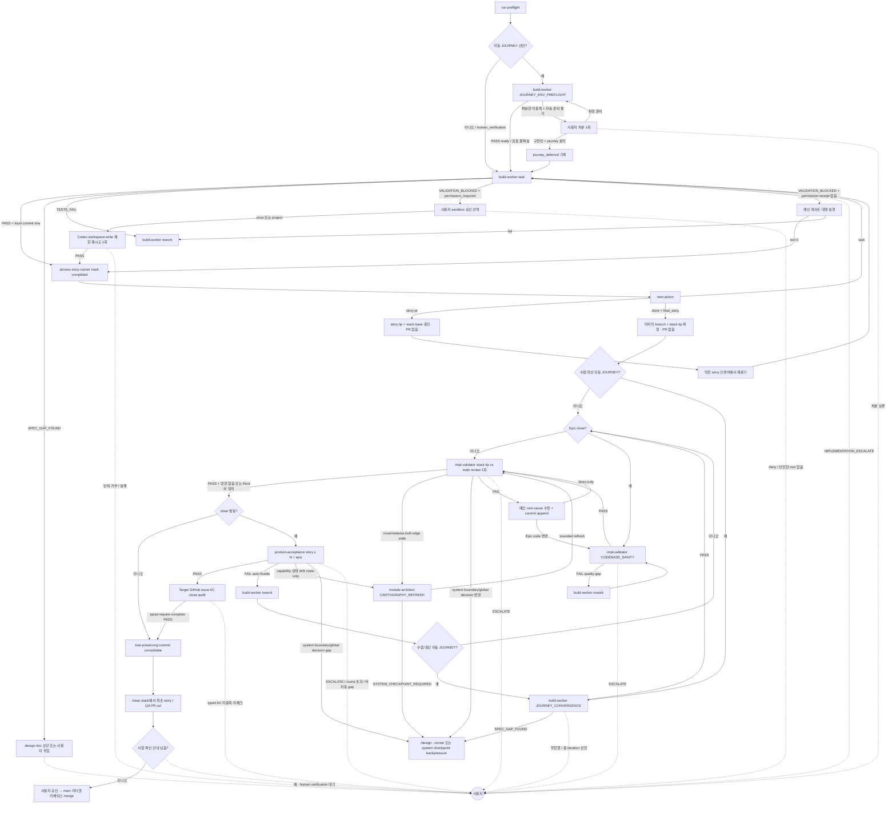

# impl-loop 분기 규칙 SSOT

> **Status**: ACTIVE
> **Scope**: `/impl-loop` skill 전용. 단일 구현 엔진 `build-worker`, merge candidate reviewer `impl-validator`, inline `product-acceptance` 의 결론 → 다음 호출 + retry 한도 + escalate 처리를 정한다. 진행 절차는 [`SKILL.md`](SKILL.md).

## 읽는 법

agent 는 prose 마지막 단락에 결론과 사유를 적는다. 메인 Claude 가 prose 를 읽고 아래 매핑으로 다음 행동을 정한다. 이 문서는 형식 강제가 아니라 판단 보조다. prose 가 모호하면 사용자에게 위임한다.

분기 규칙은 skill 이 소유한다. agent 는 결론만 내고, 그 결론이면 다음 누구를 호출하는지는 본 문서가 정한다.

## 분기 그래프

canvas-design 은 UI 작업의 main-owned checkpoint 이며 helper begin/end-step 비대상이다. draft가 필요할 때 mode 없는 foreground designer Agent는 lifecycle hook 경로로 연다. `canvas-design PASS` 뒤에는 같은 `build-worker` 경로로 들어간다.

`JOURNEY_ENV_PREFLIGHT`와 `JOURNEY_CONVERGENCE`는 기존 build-worker의 내부 mode다. 신규 agent나 신규 공개 진입점이 아니며, journey 미선언 run에는 두 mode 모두 비발동이다.

env 확실 미충족 + 자동 준비 불가에서 사용자가 검수 분리를 선택하면 메인은 해당 `journey_id`를 현재 run의 `journey_deferred` 목록으로 진행 뷰와 이후 agent prompt에 보존한다. 이는 manifest의 설계 선언을 바꾸는 값이 아니다. 해당 journey는 현재 run에서 `JOURNEY_CONVERGENCE 비발동`, `product-acceptance sealed journey 실행 비발동`, `종료 조건의 수렴 PASS Must 비대상`이며 human verification/follow-up으로 남는다. 그 target AC가 속한 story/epic은 close candidate가 아니므로 AC close audit을 발동하지 않고 PR body에 `Closes`를 붙이지 않는다. 다른 수렴 대상 journey는 그대로 진행한다.

## 결론 → 다음 호출

| step | 결론 → 다음 |
|---|---|
| **build-worker:`JOURNEY_ENV_PREFLIGHT`** | 자동 `(JOURNEY)`가 있을 때 구현 전 1회, main이 아니라 실제 worker 실행 컨텍스트에서 probe · 충족 또는 자동 준비 성공 → `PASS` 후 task loop · 검출 불확실 → 불확실 근거를 남긴 `PASS` 후 task loop · 확실한 미충족 + 자동 준비 불가 → 구현 전에 사용자에게 환경 먼저 준비 / 구현만 진행하고 journey 검수 분리 중 하나를 1회 확인 · 분리 선택 → 해당 journey를 run-local `journey_deferred`로 보존하고 수렴·sealed acceptance·close 경계에서 제외. journey 미선언과 설계상 `human_verification`은 mode 자체가 비발동 |
| **build-worker** | `PASS` + local commit sha + clean status → `dcness-story-runner mark --status completed --commit <sha>` 후 `next-action` · `TESTS_FAIL` → build-worker rework(≤3) · `SPEC_GAP_FOUND` → design-doc 보강 또는 사용자 위임 · `VALIDATION_BLOCKED` + `permission_required` → outbound network 범위·제안 root·근거·`workspace-write` 유지·`danger-full-access` 미사용을 설명하고 사용자에게 이번 실행에만 허용/이 프로젝트에 저장/거부 선택 요청. 승인하면 Codex만 1회 제한 재시도, 거부·malformed settings·안전한 root 없음·반복 sandbox 거부면 권한 확대/host 직접 검증/다른 provider 우회 없이 사용자 위임 · permission receipt 없음 → 메인이 같은 worktree cwd에서 worker 검증 명령 실행, exit 0이면 PASS와 동일, 실패면 build-worker rework(≤3), 메인도 실행 불가면 사용자 위임 · `IMPLEMENTATION_ESCALATE` → 사용자 |
| **headless execution recovery** | mutation 뒤 `timeout` / `idle_timeout` / `empty_output` / `boundary_violation` / `tdd_guard` → 같은 provider + 같은 workspace bounded continuation, 기존 diff 보존, mutation-time guard 재검사(기본 ≤2) · hard boundary 자동 확대 / `tdd-exempt` 자동 삽입 / dirty cross-provider fallback 금지 · 한도 소진 또는 제품 의미·새 권한 필요 → 사용자 |
| **dcness-story-runner `next-action`** | `task` → 다음 task build-worker · `story-pr` → 응답의 `pr_base`와 직전 story tip만 봉인하고 PR 없이 `next_branch_base`의 직전 story 브랜치에서 재분기 · `done` → `final_story` tip과 `stack_tip` vs main candidate를 확정하고 조건부 journey 수렴으로 진행 · `blocked` / `error` → task note를 근거로 retry 한도 내 재시도 또는 사용자 위임 |
| **build-worker:`JOURNEY_CONVERGENCE`** | 모든 task 뒤 final stack tip의 fresh context에서 `journey_deferred`가 아닌 자동 journey를 먼저 1회 실행 · 첫 실행 PASS → 즉시 review · 실패 → 실행→관찰→배관 수정→재실행 · production gap → 재현 테스트 RED→GREEN + 의미 단위 commit · 설계·AC 충돌 → `SPEC_GAP_FOUND`로 중단 · device 유실은 자동 재준비 1회 · 무진행/총 iteration 상한 초과 → 커밋 보존 후 사용자 처분 3택 |
| **impl-validator:CODEBASE_SANITY** | Epic close final candidate에서만 실행. 작은 repo는 전체 repo, 큰 repo는 affected module과 affected dependency cone + cheap global signals · `PASS` → local receipt 보존 후 일반 merge review · `FAIL [quality-gap]` → build-worker rework 후 새 code revision에서 Sanity 재감사(≤3) · `ESCALATE` → 사용자 |
| **impl-validator** | stack tip vs main diff와 journey `target_ac` ↔ flow assertion 고정 대조 `PASS` → close 발동 여부 확인 · `FAIL`(`[spec-gap]` 또는 `[quality-gap]`) → 메인 root-cause 수정. 단일 story는 해당 branch commit, story PR 이 2개 이상인 topology면 story-local FAIL은 해당 story PR 브랜치 commit + downstream restack, cross-cutting FAIL은 QA branch 흡수 + 재리뷰(≤3). 아직 PR은 cut하지 않음 · `ESCALATE` → 사용자 |
| **Cartography freshness** | build-worker Cartography impact + merge candidate diff + affected Root Cartography + 관련 epic/decision이 `영향 없음 또는 Root와 일치` → 기존 경로 · route/state/as-built edge stale → `module-architect:CARTOGRAPHY_REFRESH` bounded refresh + impl-validator 재검증 · system boundary/global decision 변경 → `/design --revise` 또는 system checkpoint backpressure |
| **product-acceptance** | 수렴과 review가 끝난 최종 tip에서 close candidate story×N + epic을 sealed 실행으로 판정하며 수렴 receipt를 재사용하지 않는다. `journey_deferred`는 실행·PASS·close 증거에서 제외하고 human verification/follow-up으로 보고하며 나머지 journey만 새 receipt를 만든다. `PASS` → target GitHub issue AC close audit. 1-story fix는 PR cut 전 해당 branch commit, N-story tracked cross-cutting fix/flow 보정은 QA branch 흡수 · Epic code 변경은 수렴/Sanity/impl-validator 증거를 stale 처리하고 수렴부터 재진입, Story-only는 수렴/impl-validator 재리뷰 + acceptance 재검수(≤3) · capability 상태 drift가 route-only stale → `CARTOGRAPHY_REFRESH` + 같은 diff+갱신 Root impl-validator 재검증 + acceptance 재검수 · system boundary/global decision gap → `/design --revise`/checkpoint · `FAIL` 비자동 gap / round 초과 / `ESCALATE` → 사용자 |
| **target GitHub issue AC close audit** | 메인이 acceptance verdict로 자동/`(JOURNEY)` typed AC만 체크한다. `check_issue_body.mjs --acceptance-only --require-complete`의 정확한 `PASS` → commit consolidate · checklist 밖 사람 확인 항목은 미체크 상태의 별도 merge gate로 보존 · typed AC 미충족·미체크 → clean 마감 금지, 구현 보강 (`blocked` 아님) |
| **commit consolidate → PR cut** | 수렴 iteration 노이즈가 있을 때만 의미 단위 commit으로 재구성하고 전후 tree identity가 같아야 함. 이미 의미 단위면 no-op · 그 뒤 단일 story와 다중 story/조건부 QA stack 모두 clean 상태에서 최초 PR을 cut · 사람 확인 항목이 남으면 PR cut 뒤 human verification 대기, 없으면 사용자 merge 승인 대기 · CI rerun/인프라 복구로 tree 불변이면 기존 verdict 유효, tracked tree 변경이면 수렴부터 stale 재검증 |

loop의 자동 merge 금지: 사용자가 유일한 merge gate다. 승인 뒤에만 대상 PR을 base=`main`으로 리타겟·리베이스하고 merge helper를 호출한다.

task 구현 호출에서 `(JOURNEY)` REQ는 PASS 블로커가 아니다. build-worker가 flow 대본, `.dcness/` 밖 journey 매니페스트, 필요한 setup/teardown/상태전이 스크립트, `acceptance_environment`, `harness_paths`를 작성하고 수렴·acceptance 인계를 보고하면 task `PASS`로 진행한다. 그러나 모든 task 뒤 `journey_deferred`가 아닌 자동 journey의 `JOURNEY_CONVERGENCE PASS`는 integrated review의 선행 Must다. 이 경로는 메인 게이트 대행용 `VALIDATION_BLOCKED`와 다르다.

## retry 한도

| 재시도 경로 | 한도 | 초과 시 |
|---|---|---|
| build-worker `TESTS_FAIL` 또는 메인 게이트 대행 실패 | 3 | 사용자 위임 |
| headless mutation 뒤 recoverable 실행/guard 실패 | 2 | diff 보존 + 사용자 위임 |
| Codex `permission_required` 사용자 승인 재시도 | 1 | 추가 확대 없이 사용자 위임 |
| `JOURNEY_CONVERGENCE` 같은 실패 서명이 수정 시도 후 반복되는 무진행 라운드 | 3 | 커밋 보존 후 사용자 처분 3택 |
| `JOURNEY_CONVERGENCE` 총 iteration | 12 | 실패 서명 변화와 무관하게 커밋 보존 후 사용자 처분 3택 |
| journey 실행 중 device 유실·재부팅 자동 재준비 | 1 | 무진행/총 iteration을 소비하지 않고 재실행, 다시 유실되면 사용자 처분 3택 |
| Codebase Sanity `FAIL` → build-worker rework → Sanity 재감사 | 3 | 사용자 위임 |
| impl-validator `FAIL` → 메인 root-cause 수정 → 재리뷰 | 3 | 사용자 위임 |
| product-acceptance `FAIL` auto-fixable gap → rework → 재검수 | 3 | 사용자 위임 |
| `SPEC_GAP_FOUND` design-doc 보강 | 1 | 사용자 위임 또는 `/design` 회수 |

finding 수용 원칙: 같은 파일·주제·위험 클래스 finding 이 반복되면 점 패치가 아니라 root cause 를 재검토한다. 설계가 부족하면 `/design` 으로 회수한다.

journey 무진행은 실패 단계 + exit code + 정규화한 핵심 오류의 같은 서명이 수정 시도 후 다시 나타날 때만 센다. 서로 다른 실패가 앞 실패 해소 뒤 순차 노출되고 이전 서명이 재발하지 않으면 한도를 소비하지 않는다. 실패 서명은 자초 회귀와 잠재 노출을 완전히 구분하지 못하므로 **총 iteration 12회가 실질 runaway 가드**다.

두 수렴 상한 중 하나를 소진하면 작업 커밋을 보존하고 사용자가 다음 셋 중 하나를 고른다: **수렴 재개 / production 만 착지하고 journey를 human verification 대기 또는 follow-up으로 분리 / run 폐기**. production 만 착지를 고르면 env preflight의 분리 선택과 같은 run-local `journey_deferred` 처분을 적용해 story issue를 닫지 않고 PR body에 `Closes`를 붙이지 않는다. 이 선택은 env preflight의 구현 전 2택과 별개이며, happy path에서 추가 질문을 만들지 않는다.

## 마감 acceptance 분기

Epic close의 Codebase Sanity는 acceptance보다 먼저 수행한다. 모든 Story/PR마다 full-repo audit을 반복하지 않고 최종 stack tip(QA PR이 있으면 QA branch) vs main candidate 1회가 기본이다. 메인이 code revision과 실제 test/lint/build/typecheck/coverage 명령·exit/warning을 수집하며, coverage 도구가 없으면 `UNKNOWN`이다. 결과는 `dcness-helper sanity-receipt-dir --project-root "$PROJECT_ROOT"`가 반환한 persistent primary-worktree `.dcness-work/codebase-sanity/`에 local receipt로 보존해 linked `ExitWorktree` 뒤에도 재사용한다. 코드 변경은 Sanity와 일반 impl-validator 증거를 모두 stale로 만들어 Sanity부터 재진입한다. receipt는 canonical Root `CARTOGRAPHY_REFRESH` 또는 다음 design의 현재 코드 대조를 대신하지 않는다.

story/epic close 를 실제 발동할 candidate의 impl-validator `PASS` 후 · 최초 PR cut 전 product-acceptance 검수를 끼운다. 기본 ON, `--no-acceptance` 명시 run 만 비대상이다. product-acceptance 를 생략해도 target GitHub issue AC close audit 은 생략되지 않는다.

impl-validator 는 계획 대비 구현 정합과 merge candidate diff 위험을 검토한다. 여러 PR 이 합쳐진 story 동작과 여러 story 가 합쳐진 epic 동작의 사용자 관찰 가능 동작은 마감 product-acceptance 가 맡는다.

여러 task commit이 합쳐진 story 동작은 봉인된 story branch tip과 acceptance 증거를 함께 보고 판정한다. 여러 story branch가 stack tip에서 합쳐진 epic 동작도 같은 원칙으로 product-acceptance가 맡는다. product-acceptance는 개별 task green이 아니라 story/epic close 시점의 사용자 동작 전체를 검수한다.

STORY/EPIC_ACCEPTANCE는 build-worker 수렴 결과와 별도로 최종 tip에서 `journey_deferred`가 아닌 flow를 다시 실행해 sealed receipt를 생성·판정한다. deferred journey는 human verification/follow-up으로만 보고하며 그 target AC가 속한 story/epic close에는 사용하지 않는다. 수렴 대상 매니페스트/e2e가 없으면 실행 불가 gap과 도입 제안을 보고하며 특정 e2e 도구를 강제하지 않는다.

Cartography freshness도 같은 close 경계의 Must다. capability 상태 drift, 미해소 route/state/as-built edge, system backpressure가 남으면 최종 clean과 merge로 진행하지 않는다. `CARTOGRAPHY_REFRESH`는 기존 module-architect의 bounded producer mode이며, local-only/ignored private docs는 code PR에 강제 포함하지 않고 canonical local refresh 또는 durable impact handoff를 보존한다. durable impact handoff만으로 freshness가 해소되지는 않으며 canonical local Root refresh 확인 전에는 최종 clean이 아니다. build-worker와 읽기 전용 validator가 docs를 직접 수정하지 않는다.

- story close: `STORY_ACCEPTANCE`
- 여러 story close: `STORY_ACCEPTANCE` 를 story × N
- epic close: 모든 story PASS 뒤 `EPIC_ACCEPTANCE`

gap 수정 commit 이 생겼으면 마지막 acceptance gap 수정 commit 이후의 PASS 만 clean 증거다. 이전 PASS 는 stale 이므로 STORY_ACCEPTANCE 부터 다시 돌린다.

auto-fixable gap: PRD 유저 시나리오 / Story AC 미충족, 검수 증거 부족, 스모크 실패, mock-only green / 동작 증거 부족, 화면 증거 부재, 사용자 동선 부적합 / 내부 계약 노출, 구현 보강으로 닫히는 목업 불일치, 명확한 사용자 동선 보강. 비자동 gap: 설계 결함, 범위 재정의, 사용자/UX 선택 필요, 보안/권한/데이터 리스크.

## clean / blocked 판정

- task clean = build-worker PASS + phase prose 3개 + local commit sha + clean status + story-runner mark.
- story boundary clean = 해당 story의 모든 task completed + story branch tip/base 봉인 + PR 없이 다음 branch를 직전 story branch에서 재분기.
- integrated review clean = 모든 target task completed + stack tip 확정 + `journey_deferred`가 아닌 자동 journey면 env preflight 증거와 `JOURNEY_CONVERGENCE PASS` + Epic close이면 현재 code revision의 `impl-validator:CODEBASE_SANITY` PASS와 receipt + 일반 impl-validator PASS.
- close 발동 candidate clean = integrated review clean + 필요한 product-acceptance PASS + typed target GitHub issue AC 전항목 충족·체크 + `require-complete`의 정확한 `PASS`. checklist 밖 사람 확인 항목은 delivery를 막지 않고 merge 전 별도 human verification gate로 남긴다.
- deferred production candidate clean = integrated review clean + `journey_deferred`의 human verification/follow-up handoff + close/acceptance/AC audit 비발동 근거. 이는 해당 story/epic의 clean close가 아니다.
- delivery clean = (close 발동 candidate clean 또는 deferred production candidate clean) + tree identity 불변 commit consolidate 또는 no-op 근거 + 그 뒤 최초 story/조건부 QA PR 생성. deferred candidate는 `Closes` 없이 `Document-Exception-PR-Close` 사유를 둔다. loop의 자동 merge는 여전히 0회다.
- verify-only clean = 검증 명령 exit 0 + 변경 0 + validator PASS.

false-clean 의심 시 blocked. 예: phase prose 부재, commit sha 부재, `journey_deferred`가 아닌 자동 journey 수렴 미실행, close candidate의 impl-validator/acceptance/target issue AC 감사 미충족, deferred production candidate의 handoff·PR 예외 사유 부재, consolidate tree identity 또는 최종 PR 흔적 부재. 단, PR cut 전 정상 중간 단계와 자동 항목은 모두 끝났고 사람 판정만 남은 `human verification 대기`는 blocked 로 뭉뚱그리지 않는다.

## escalate 처리

`IMPLEMENTATION_ESCALATE`, `ESCALATE`, retry 한도 초과, 비자동 acceptance gap 은 즉시 사용자 보고 후 대기한다. journey 수렴 한도는 위 3택을 사용하고, 그 밖의 자동 복구 / 우회 / 재시도는 금지한다.

## 후속

clean → 5줄 요약 + 전체 완료 보고. 전체 완료 뒤 자율 작업(이슈 등록 / cleanup / 분석)으로 이어가면 진입 전 `post-task-begin` marker 를 호출해 task ROI 측정을 분리한다 (#472). error/blocked → 남은 finding, 실패 명령, 다음 판단 지점을 보고한다.
