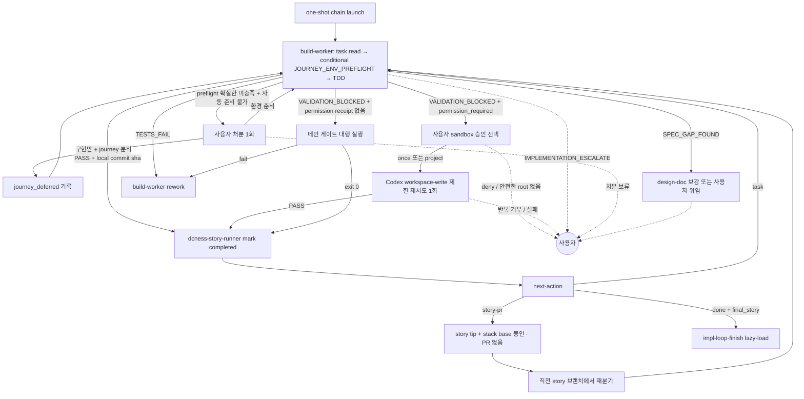

# impl-loop 분기 규칙 SSOT

> **Status**: ACTIVE
> **Scope**: `/impl-loop` worker 시작부터 모든 task completed 전까지의 실패·복구·다음 task 분기를 정한다. completed 이후 review·acceptance·PR 분기는 [`impl-loop-finish.md`](impl-loop-finish.md)가 소유한다. 진행 절차는 [`SKILL.md`](SKILL.md).

## 읽는 법

agent 는 prose 마지막 단락에 결론과 사유를 적는다. 메인 Claude 가 prose 를 읽고 아래 매핑으로 다음 행동을 정한다. 이 문서는 형식 강제가 아니라 판단 보조다. prose 가 모호하면 사용자에게 위임한다.

분기 규칙은 skill 이 소유한다. agent 는 결론만 내고, 그 결론이면 다음 누구를 호출하는지는 본 문서가 정한다.

## 분기 그래프

`JOURNEY_ENV_PREFLIGHT`는 기본 build-worker 호출 안의 내부 phase다. 신규 agent, mode, outer lifecycle step, 공개 진입점을 만들지 않으며 journey 미선언 run에는 비발동이다. completed 이후 `JOURNEY_CONVERGENCE` 계약은 마감 진본에서만 읽는다.

env 확실 미충족 + 자동 준비 불가에서 사용자가 검수 분리를 선택하면 메인은 해당 `journey_id`를 현재 run의 `journey_deferred` 목록으로 진행 뷰와 이후 agent prompt에 보존한다. 이는 manifest의 설계 선언을 바꾸는 값이 아니다. 해당 journey는 현재 run에서 `JOURNEY_CONVERGENCE 비발동`, `product-acceptance sealed journey 실행 비발동`, `종료 조건의 수렴 PASS Must 비대상`이며 human verification/follow-up으로 남는다. 그 target AC가 속한 story/epic은 close candidate가 아니므로 AC close audit을 발동하지 않고 PR body에 `Closes`를 붙이지 않는다. 다른 수렴 대상 journey는 그대로 진행한다.

## 결론 → 다음 호출

| step | 결론 → 다음 |
|---|---|
| **build-worker 내부 `JOURNEY_ENV_PREFLIGHT`** | 자동 `(JOURNEY)`가 있을 때 기본 worker가 task를 읽은 직후 source read/edit 전 1회, main이 아니라 실제 worker 실행 컨텍스트에서 probe · 충족 또는 자동 준비 성공 → 같은 호출의 task TDD · 검출 불확실 → 불확실 근거를 남기고 같은 호출의 task TDD · 확실한 미충족 + 자동 준비 불가 → 구현 전에 사용자에게 환경 먼저 준비 / 구현만 진행하고 journey 검수 분리 중 하나를 1회 확인 · 분리 선택 → 해당 journey를 run-local `journey_deferred`로 보존하고 수렴·sealed acceptance·close 경계에서 제외. journey 미선언과 설계상 `human_verification`만 있으면 phase 비발동 |
| **build-worker** | `PASS` + local commit sha + clean status → `dcness-story-runner mark --status completed --commit <sha>` 후 `next-action` · `TESTS_FAIL` → build-worker rework(≤3) · `SPEC_GAP_FOUND` → design-doc 보강 또는 사용자 위임 · `VALIDATION_BLOCKED` + `permission_required` → outbound network 범위·제안 root·근거·`workspace-write` 유지·`danger-full-access` 미사용을 설명하고 사용자에게 이번 실행에만 허용/이 프로젝트에 저장/거부 선택 요청. 승인하면 Codex만 1회 제한 재시도, 거부·malformed settings·안전한 root 없음·반복 sandbox 거부면 권한 확대/host 직접 검증/다른 provider 우회 없이 사용자 위임 · permission receipt 없음 → 메인이 같은 worktree cwd에서 worker 검증 명령 실행, exit 0이면 PASS와 동일, 실패면 build-worker rework(≤3), 메인도 실행 불가면 사용자 위임 · `IMPLEMENTATION_ESCALATE` → 사용자 |
| **headless execution recovery** | mutation 뒤 `timeout` / `idle_timeout` / `empty_output` / `boundary_violation` / `tdd_guard` / canonical phase prose `phase_evidence` → 같은 provider + 같은 workspace bounded continuation, 기존 diff 보존, mutation-time guard 재검사(기본 ≤2) · hard boundary 자동 확대 / `tdd-exempt` 자동 삽입 / dirty cross-provider fallback 금지 · 한도 소진 또는 제품 의미·새 권한 필요 → 사용자 |
| **dcness-story-runner `next-action`** | `task` → 다음 task build-worker · `story-pr` → 응답의 `pr_base`와 직전 story tip만 봉인하고 PR 없이 `next_branch_base`의 직전 story 브랜치에서 재분기 · `done` → `final_story` tip과 `stack_tip`을 확정하고 [`impl-loop-finish.md`](impl-loop-finish.md)를 lazy-load · `blocked` / `error` → task note를 근거로 retry 한도 내 재시도 또는 사용자 위임 |

task 구현 호출에서 `(JOURNEY)` REQ는 PASS 블로커가 아니다. build-worker가 flow 대본, `.dcness/` 밖 journey 매니페스트, 필요한 setup/teardown/상태전이 스크립트, `acceptance_environment`, `harness_paths`를 작성하고 마감 인계를 보고하면 task `PASS`로 진행한다. 메인 게이트 대행용 `VALIDATION_BLOCKED`와는 다른 경로다.

## retry 한도

| 재시도 경로 | 한도 | 초과 시 |
|---|---|---|
| build-worker `TESTS_FAIL` 또는 메인 게이트 대행 실패 | 3 | 사용자 위임 |
| headless mutation 뒤 recoverable 실행/guard 실패 | 2 | diff 보존 + 사용자 위임 |
| Codex `permission_required` 사용자 승인 재시도 | 1 | 추가 확대 없이 사용자 위임 |
| `SPEC_GAP_FOUND` design-doc 보강 | 1 | 사용자 위임 또는 `/design` 회수 |

finding 수용 원칙: 같은 파일·주제·위험 클래스 finding 이 반복되면 점 패치가 아니라 root cause 를 재검토한다. 설계가 부족하면 `/design` 으로 회수한다.

## task clean / blocked

- task clean = build-worker PASS + phase prose 3개 + local commit sha + clean status + story-runner mark.
- story boundary clean = 해당 story의 모든 task completed + story branch tip/base 봉인 + PR 없이 다음 branch를 직전 story branch에서 재분기.
- phase prose, commit sha, clean status, state mark 중 하나라도 없으면 false-clean blocked로 판정하고 다음 task로 넘기지 않는다.
- 모든 target task가 completed 되면 이 문서를 더 읽지 않고 [`impl-loop-finish.md`](impl-loop-finish.md)로 이동한다.

## escalate 처리

`IMPLEMENTATION_ESCALATE`, retry 한도 초과, 제품 의미·권한 변경 필요는 즉시 사용자 보고 후 대기한다. 그 밖의 자동 복구 / 우회 / 재시도는 금지한다.

## 후속

task clean → mark + next-action. error/blocked → 남은 finding, 실패 명령, 다음 판단 지점을 보고한다. 전체 완료 보고와 후속 marker는 마감 진본이 소유한다.
