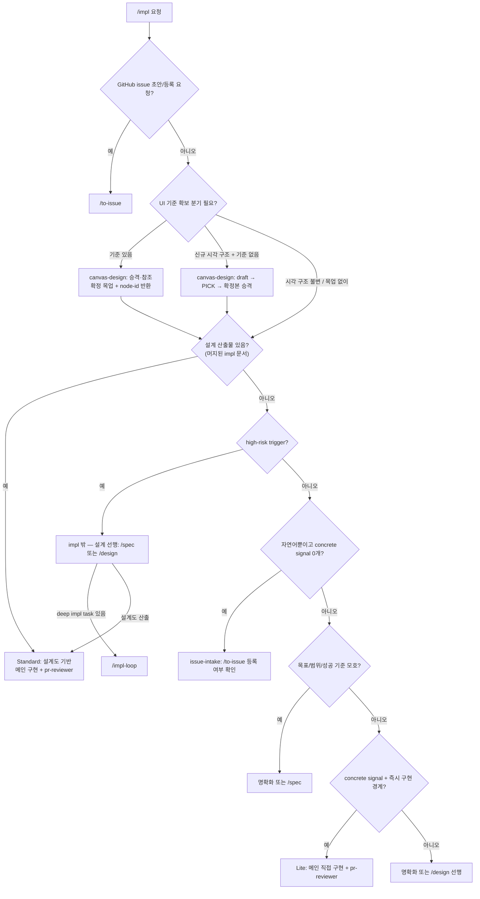

# impl 분기 규칙 SSOT

> **Status**: ACTIVE
> **Scope**: `/impl` skill 전용. 자유 구현 요청을 issue-intake / Lite / Standard / impl 밖 설계 선행으로 판정하고, review provider 와 retry/escalate 를 정한다. 진행 절차는 [`SKILL.md`](SKILL.md). 용어·공개 진입점·분기 표현을 수정하거나 리뷰할 때는 [`terms.md`](../../docs/plugin/terms.md) 를 확인한다.

## 읽는 법

분기 규칙은 권고다. hard safety gate 는 branch/PR/test/review/CI 와 기존 순서 차단 훅이 보존한다. 사용자는 구현 경로를 외우지 않고 `/impl <작업>`만 말하면 된다. impl 은 설계를 하지 않는다 — 설계도가 있으면 보고 구현만 하고, 없으면 concrete signal 로 메인이 직접 고칠 수 있는지 판단한다.

일반 `/impl` 의 구현 주체는 항상 메인이다. `test-engineer` / `engineer` / `build-worker` 같은 구현 agent 는 일반 `/impl` 구현자로 호출하지 않는다. 격리되는 것은 review step 이며, `pr-reviewer` provider 만 local routing 으로 Claude sub-agent 또는 Codex headless wrapper 중 하나를 쓴다. deep task 파일을 headless story/epic runner 로 돌리는 흐름은 [`/impl-loop`](../impl-loop/SKILL.md) 의 영역이다.

## 구현 경로 판정 그래프



> 그래프 최상단 `DOC{설계 산출물 있음?}` 가 impl 의 **1차 분기**다 — 있으면 Standard, 없으면 그 아래(`HR`/`NL`/`CS`)로 내려 Lite 직접 구현인지 issue-intake/설계 선행인지 가른다. 설계 깊이(경량/full) 판단은 impl 이 직접 하지 않고 설계 레이어로 내려보낸다. high-risk 는 impl *내부 구현 경로가 아니라* impl 밖 설계 선행이다. 아래 `## 설계 산출물 유무` 절은 이 노드의 prose 진술이다.

UI 작업이면 `DOC` 앞에서 **UI 기준 확보 분기**를 먼저 본다. 이는 설계 깊이 분기가 아니라 시각 기대 고정 기준 배선이다. 사용자 제공 이미지·스케치·HTML 또는 기존 확정본이 있으면 "기준 있음" 으로 인정하고, 신규 시각 구조 + 기준 없음이면 내부 [`canvas-design`](../canvas-design/SKILL.md) 으로 draft/PICK/확정본 승격을 수행한다. 시각 구조 불변이거나 사용자가 "목업 없이" 라고 지시하면 mockup 생성을 생략한다.

메인 echo:

```text
UI 기준: 기준 있음 — <사용자 제공 이미지|스케치|기존 확정본> → docs/design-variants/<screen-id>.html, 구현 입력에 node-id 매핑 포함
UI 기준: 신규 시각 구조 + 기준 없음 — canvas-design 으로 draft/PICK/확정본 승격 후 구현
UI 기준: 시각 구조 불변 — 목업 없이 구현
구현 경로: issue-intake — concrete signal 없음, next = /to-issue 등록 여부 확인
구현 경로: Lite — 설계도 없음, concrete signal = <파일/이슈/테스트>, 구현 = 메인 직접, review_provider = <claude|codex>
구현 경로: Standard — 설계도 = <경로>, 구현 = 메인 직접, review_provider = <claude|codex>
```

## 설계 산출물 유무 — 구현 경로 판정 1차 기준 (되돌림)

구현 경로 판정 *전*에 "이 작업을 닫을 설계 산출물이 이미 있는가" 를 먼저 본다([`SKILL.md`](SKILL.md) Step 0.5) — 위 그래프의 `DOC` 노드다. 이것이 impl 의 1차 분기이며, 설계 깊이(경량/full) 판단은 impl 이 직접 하지 않고 설계 레이어로 내려보낸다. 원리 SSOT = [`workflow-router.md` 되돌림 원리](../../docs/plugin/workflow-router.md#되돌림backpressure-원리).

- 설계 문서 있음 → **Standard**. `begin-run impl --design-doc <경로>` 로 기록하고 받은 설계도로 메인이 구현만 한다.
- 설계 문서 없음 + 자연어뿐이고 concrete signal 0개 → **issue-intake**. `/to-issue` 로 이슈 등록 후 그 번호 기준으로 구현할지 사용자에게 묻는다.
- 설계 문서 없음 + 구현 경계/테스트 기준 애매 → `/impl` 안에서 설계도를 만들지 않고 사용자 명확화 또는 `/design` 선행으로 올린다.
- 설계 문서 없음 + concrete signal 충분 + high-risk 0개 → **Lite**. 계획 파일 없이 메인이 직접 구현한다.
- 설계 문서 없음 + full 설계 필요(high-risk) → impl *밖* — 설계 선행(`/design`·`/spec`) 후 설계도를 들고 Standard 재진입. deep task 파일이 있으면 `/impl-loop`, 없으면 `/spec` / `/tech-review` / `/design` 선행.

## issue-intake

자연어만 있고 concrete signal 이 없으면 바로 코드를 고치지 않는다. 사용자에게 다음 문장으로 확인한다.

```text
지금까지 이야기한 내용을 GitHub issue로 등록하고, 그 이슈 번호 기준으로 구현을 진행할까요?
```

사용자가 OK 하면 `/to-issue` 를 호출해 issue 를 생성하고, 생성된 issue 번호를 concrete signal 로 삼아 `/impl #<issue>` 흐름으로 재진입한다. 이 issue 본문은 간단한 설계도, AC, 히스토리 기준 역할을 한다. 사용자가 issue 생성을 거부하면 빠진 파일/범위/AC 를 짧게 확인하거나, 사용자가 명시적으로 "이슈 없이 진행"을 선택했을 때만 Lite 로 진행한다.

## 구현 경로 실행 매핑

| 경로 | 다음 |
|---|---|
| issue-intake | `/to-issue` 등록 여부 확인 → 생성된 issue 번호로 `/impl` 재진입 |
| Lite · 메인 직접 | 메인 직접 `test -> impl -> test pass` 후 `begin-run impl --lane lite` → `pr-reviewer` local diff |
| Standard · 메인 직접 | `begin-run impl --design-doc <경로>` 기록 후 받은 설계도로 메인 직접 `test -> impl -> test pass` → `pr-reviewer` local diff |
| high-risk → 설계 선행 | impl 밖 `/spec` / `/tech-review` / `/design` 선행. 산출된 설계도를 들고 Standard 재진입 |
| deep impl task list | `/impl-loop <task>` story/epic headless runner 로 위임 |

`code-validator` 는 일반 `/impl` 에서 호출하지 않는다. 검증 대상인 impl 계획 파일이 없기 때문이다. 최소 gate 는 테스트 선작성 또는 skip 사유, lint/build/test green, 격리 `pr-reviewer`, 단위 commit/PR, CI, false-clean 방지다.

## 결론 → 다음 호출

| 단계 | 결론 → 다음 |
|---|---|
| Lite `pr-reviewer` | `PASS` → commit/PR/CI · `FAIL` → 메인 root-cause 수정 + test 재통과 + pr-reviewer 재호출(≤3) |
| Standard `pr-reviewer` | `PASS` → commit/PR/CI · `FAIL` → 메인 root-cause 수정 + test 재통과 + pr-reviewer 재호출(≤3) |
| issue-intake | 사용자 OK → `/to-issue` 후 issue 번호 기준 재진입 · 거부 → 명확화 또는 명시적 Lite 진행 |
| outside-design | 설계 산출물 확보 → Standard 재진입 · deep task list 있음 → `/impl-loop` |

## Retry 한도

| 경로 | 한도 | 초과 시 |
|---|---|---|
| Lite pr-reviewer FAIL → 메인 root-cause 수정 | 3 | 사용자에게 남은 finding 보고 |
| Standard pr-reviewer FAIL → 메인 root-cause 수정 | 3 | 사용자에게 남은 finding 보고 |
| SPEC_GAP / 설계 부족 → 설계 선행 | 1 | `/design` 또는 사용자 |

finding 수용 원칙은 `/impl-loop` 와 같다. 같은 영역 finding 이 반복되면 줄 단위 점 패치가 아니라 root cause 를 재검토한다.

## Escalate

다음 신호는 자동 우회하지 않는다.

- 새 외부 dependency/API/SDK/model 필요 → impl 밖 설계 선행(`/spec` 내부 `/tech-review` preflight / `/design`)
- auth/security/PII/compliance 영향
- migration/destructive/public API breakage
- 설계/decision 합의 없는 cross-module/cross-story contract 변화
- 테스트 기준 또는 수용 기준이 끝까지 모호함
- review finding 이 3회 안에 수렴하지 않음

위 high-risk 신호는 impl 내부 구현 경로로 흡수하지 않고 impl *밖* 설계 선행으로 보낸다.

이 판정은 진입 시점뿐 아니라 **구현 도중** 위 신호가 뒤늦게 드러난 경우에도 같다. 이미 Lite/Standard 로 시작했더라도 무리하게 계속 진행하지 않고, 사용자에게 구체 신호와 영향 범위를 보고한 뒤 설계 선행 또는 Standard 로 승격한다. 승격은 ceremony(설계·planning) 크기를 올리는 것이지 PR/test/review/CI safety gate 를 약화하는 근거가 아니다([`workflow-router.md`](../../docs/plugin/workflow-router.md) — risk 는 escalation·ceremony sizing 근거). concrete signal 없이 low-risk 작업을 Standard 로 끌어올리지는 않는다.

## pr-reviewer provider

`pr-reviewer` 가 Claude 로 돌든 Codex 로 분기되든 `/impl` 의 단계 이름은 `pr-reviewer` 하나다. Codex companion 같은 별도 공개 review command 를 만들지 않는다. review provider 는 격리 검토 구현 방식일 뿐, 구현 주체를 바꾸는 신호가 아니다.
