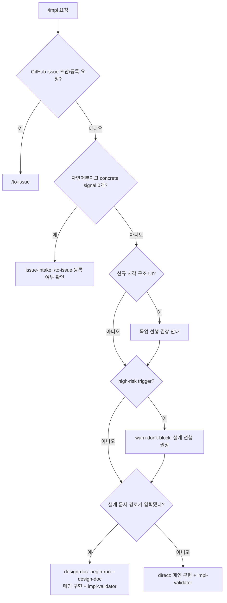

# impl 분기 규칙 SSOT

> **Status**: ACTIVE
> **Scope**: `/impl` skill 전용. 자유 구현 요청을 issue-intake / direct / design-doc 으로 echo 하고, high-risk 권고, review provider, retry 를 정한다. 진행 절차는 [`SKILL.md`](SKILL.md). 용어·공개 진입점·분기 표현을 수정하거나 리뷰할 때는 [`terms.md`](../../docs/plugin/terms.md) 를 확인한다.

## 읽는 법

분기 규칙은 권고다. hard safety gate 는 branch/PR/test/review/CI 와 순서 차단 훅이 보존한다. 사용자는 구현 경로 이름을 외우지 않고 `/impl <작업>`만 말하면 된다.

일반 `/impl` 의 구현 주체는 항상 메인이다. 별도 구현 agent 는 일반 `/impl` 구현자로 호출하지 않는다. 격리되는 것은 review step 이며, `impl-validator` provider 만 local routing 으로 Claude sub-agent 또는 Codex headless wrapper 중 하나를 쓴다. deep task 파일을 headless story/epic runner 로 돌리는 흐름은 [`/impl-loop`](../impl-loop/SKILL.md) 의 영역이다.

구현 후에는 메인의 자유 prose Cartography impact와 merge candidate diff, affected Root Cartography 좌표, 관련 epic/decision을 읽기 전용 `impl-validator`에 함께 전달한다. 이 freshness boundary는 direct와 design-doc 모두 동일하다.

## 구현 경로 판정 그래프

UI 작업이면 구현 route echo 와 별도로 **UI 기준 확보 분기**를 먼저 본다. 기준 있음(사용자 제공 이미지·스케치·HTML 또는 기존 확정본), 신규 시각 구조 + 기준 없음, 시각 구조 불변의 3분기다. 신규 시각 구조면 목업 선행을 권장하고, 사용자가 동의하면 내부 `canvas-design` 으로 확정 목업을 만든다. 사용자가 "목업 없이" 또는 "그냥 가"라고 하면 `ux-flow` 정도만 참고해 구현한다.

```text
UI 기준: 기준 있음 — 사용자 제공 이미지 또는 기존 확정본 사용
UI 기준: 신규 시각 구조 + 기준 없음 — 목업 선행 권장
UI 기준: 시각 구조 불변 — 목업 없이 구현
```



메인 echo:

```text
구현 경로: issue-intake — concrete signal 없음, next = /to-issue 등록 여부 확인
구현 경로: direct — concrete signal = <파일/이슈/테스트>, 구현 = 메인 직접, review_provider = <claude|codex>
구현 경로: design-doc — 설계도 = <경로>, 구현 = 메인 직접, review_provider = <claude|codex>
권고: high-risk 신호 감지 — 설계 선행을 권장하지만 사용자가 진행하면 구현
UI 기준: 신규 시각 구조 — 목업 선행 권장, 사용자가 생략 지시하면 ux-flow 참고 후 구현
```

## issue-intake

자연어만 있고 concrete signal 이 없으면 바로 코드를 고치지 않는다. 사용자에게 다음 문장으로 확인한다.

```text
지금까지 이야기한 내용을 GitHub issue로 등록하고, 그 이슈 번호 기준으로 구현을 진행할까요?
```

사용자가 OK 하면 `/to-issue` 를 호출해 issue 를 생성하고, 생성된 issue 번호를 concrete signal 로 삼아 `/impl #<issue>` 흐름으로 재진입한다. 사용자가 issue 생성을 거부하면 빠진 파일/범위/AC 를 짧게 확인하거나, 사용자가 명시적으로 "이슈 없이 진행"을 선택했을 때만 direct 로 진행한다.

## direct / design-doc

| 경로 | 다음 |
|---|---|
| direct · 메인 직접 | concrete signal 을 읽고 메인 직접 `test -> impl -> test pass` 후 `begin-run impl` → `impl-validator` local diff |
| design-doc · 메인 직접 | `begin-run impl --design-doc <경로>` 기록 후 받은 설계도로 메인 직접 `test -> impl -> test pass` → `impl-validator` local diff |

일반 `/impl` 도 `impl-validator` 를 호출한다. direct 에 대상 issue 가 있으면 계획 파일이 없어도 spec 렌즈를 켜고 **target GitHub issue AC** 를 대조한다. design-doc 경로의 spec 기준은 plan ∪ target GitHub issue AC 이며, 대상 issue 가 없는 direct 만 quality 렌즈로 검토한다. 최소 gate 는 테스트 선작성 또는 skip 사유, lint/build/test green, 격리 `impl-validator`, 단위 commit/PR, CI, false-clean 방지다.

대상 issue 가 있는 경로는 target GitHub issue AC 전항목 충족과 자동 판정 가능한 체크박스 전부 check 후 `check_issue_body.mjs --acceptance-only --require-complete` PASS 까지가 clean 조건이다. 미충족·미체크 AC 가 남으면 clean 마감과 close 발동을 금지한다. agent 가 체크할 수 없는 human verification 은 목록을 보고 merge 전에 정지하며, 이 대기 상태를 `blocked` 로 분류하지 않는다.

## high-risk warn-don't-block

다음 신호가 보이면 메인은 설계 선행을 권장한다고 한 줄 경고한다.

- 새 product feature / epic
- 외부 dependency / API / SDK / model 선택
- auth / security / PII / compliance
- migration / destructive change
- public API breakage
- cross-module / cross-story interface
- 테스트 기준 또는 수용 기준이 끝까지 모호함

이 경고는 차단이 아니다. 사용자가 명시적으로 `/impl` 을 지시했거나 "그대로 진행"을 선택하면 구현한다. 권고 → 강제 자동 승격 금지. 단, 구현 중 되돌리기 어려운 변경을 실제로 수행해야 하는 시점에는 영향과 선택지를 보고하고 사용자 결정을 받는다.

## Review Provider

`impl-validator` 기본 provider 는 구현자의 상대 진영이다.

| 구현자 | 기본 review provider |
|---|---|
| `/impl` 메인 Claude | Codex 가능 시 Codex, 불가 시 Claude |
| `/impl-loop` codex-headless build-worker | Claude |
| `/impl-loop` claude-headless build-worker | Codex 가능 시 Codex, 불가 시 Claude |

`routing.json` 명시 provider 는 계속 존중한다. Codex CLI 가 없거나 `dcness-codex-validator` wrapper 가 비정상 종료하면 Claude `impl-validator` 로 폴백하고 폴백 사실을 한 줄로 고지한다.

## 결론 → 다음 호출

| 단계 | 결론 → 다음 |
|---|---|
| direct `impl-validator` | `PASS` → commit/PR/CI · target issue 가 있으면 AC close audit · `FAIL`(`[spec-gap]` 또는 `[quality-gap]`) → 메인 root-cause 수정 + test 재통과 + impl-validator 재호출(≤3) |
| design-doc `impl-validator` | `PASS` → commit/PR/CI · `FAIL`(`[spec-gap]` 포함) → 메인 로직 수정 · `FAIL`(`[quality-gap]`만) → 메인 polish 수정 · 이후 test 재통과 + impl-validator 재호출(≤3) |
| issue-intake | 사용자 OK → `/to-issue` 후 issue 번호 기준 재진입 · 거부 → 명확화 또는 명시적 direct 진행 |

Cartography freshness 결과는 위 PASS/FAIL 의미 안에서 다음처럼 결정적으로 연결한다.

| 결과 | 다음 |
|---|---|
| 영향 없음 또는 Root와 일치 | 기존 commit/PR/CI 경로 계속 |
| system boundary 유지 + route/state/as-built edge stale | `module-architect:CARTOGRAPHY_REFRESH`가 affected Root 좌표만 bounded refresh → 같은 merge candidate diff, 갱신 Root, 관련 epic/decision으로 impl-validator 재검증 |
| system boundary·global decision 변경 | route-only patch 금지 → clean 진행 중지 → `/design --revise` 또는 system checkpoint backpressure를 사용자에게 제시 |

`CARTOGRAPHY_REFRESH`는 새 공개 진입점이나 새 agent가 아니다. tracked docs는 branch/PR에 포함할 수 있지만 local-only/ignored private docs는 code PR에 강제 포함하지 않는다. canonical local Root 갱신이 불가능하면 affected 좌표, before/after 상태, 증거, 다음 producer를 durable impact handoff로 보존한다. durable impact handoff만으로 freshness가 해소되지는 않으므로 canonical local Root refresh 확인 전에는 PASS하지 않는다. 읽기 전용 validator는 어느 경우에도 문서를 직접 수정하지 않는다.

## Retry 한도

| 경로 | 한도 | 초과 시 |
|---|---|---|
| direct impl-validator FAIL(`[quality-gap]`) → 메인 root-cause 수정 | 3 | 사용자에게 남은 finding 보고 |
| design-doc impl-validator FAIL(`[spec-gap]` 또는 `[quality-gap]`) → 메인 root-cause 수정 | 3 | 사용자에게 남은 finding 보고 |

finding 수용 원칙은 `/impl-loop` 와 같다. 같은 영역 finding 이 반복되면 줄 단위 점 패치가 아니라 root cause 를 재검토한다.

## post-task-begin

clean → 최종 보고. 전체 완료 뒤 자율 작업(이슈 등록 / cleanup / 분석)으로 이어가면 진입 전 `post-task-begin` marker 를 호출해 task ROI 측정을 분리한다 (#472).
