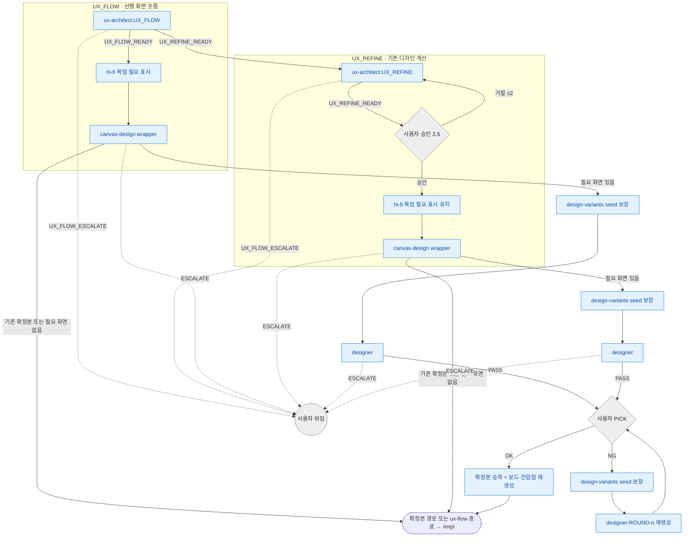

# ux 분기 규칙 SSOT

> **Status**: ACTIVE
> **Scope**: `/ux` skill **단일 전용** 분기 규칙 진본 — 이 skill 안 ux-architect / 내부 canvas-design / designer 의 결론 → 다음 호출 + 모드 전환 (UX_FLOW ↔ UX_REFINE) + cycle 한도 + escalate + 후속. 진행 절차(Step) 는 [`SKILL.md`](SKILL.md).
> **Cross-ref**: 순서 차단 훅 보존 = [`hooks.md`](../../docs/plugin/hooks.md#catastrophic-gatesh) · 권한 경계 = [`agent_boundary.py`](../../harness/agent_boundary.py) · 용어 기준 = [`terms.md`](../../docs/plugin/terms.md).

## 읽는 법

agent 는 일을 마치면 prose 마지막 단락에 어떤 결과로 끝났는지와 사유를 자기 언어로 적는다. 메인 Claude 가 그 prose 를 읽고 아래 매핑으로 다음 호출을 정한다. 이 문서는 형식 강제가 아니라 판단 보조다. 의미가 모호하면 사용자에게 위임한다.

분기 규칙은 skill 이 소유한다. agent 는 결론(enum)만 내고, 그 결론이면 다음 누구인지는 본 문서가 정한다. 같은 agent 가 다른 skill 에 나와도 그건 해당 skill 의 분기 규칙이다.

## 분기 그래프

파랑 = 생산 agent 또는 main-owned checkpoint, 회색 = 사용자 체크포인트 / 위임. `canvas-design` 은 helper begin/end-step 비대상이다. draft가 필요할 때 mode 없는 foreground designer Agent는 lifecycle hook 경로로 연다.

## 결론 → 다음 호출 매핑

| 단계 | 결론 → 다음 호출 |
|---|---|
| **ux-architect:UX_FLOW** | `UX_FLOW_READY` → 화면 인벤토리의 `hi-fi 목업 필요` 확인 → 필요한 화면만 canvas-design wrapper · `UX_REFINE_READY` → UX_REFINE 모드 전환 (ux-architect:UX_REFINE 재진입) · `UX_FLOW_ESCALATE` → 사용자 |
| **ux-architect:UX_REFINE** | `UX_REFINE_READY` → 사용자 승인(Step 2.5) → 필요한 화면만 canvas-design wrapper · `UX_FLOW_ESCALATE` → 사용자. (allowed_enums = `UX_REFINE_READY,UX_FLOW_ESCALATE`) |
| **canvas-design** | `PASS` → 확정본 경로와 node-id 매핑 기록 후 종료 · `ESCALATE` → 사용자. draft 가 필요하면 design-variants seed 보장 후 designer 를 호출한다 |
| **designer** | `PASS` → 사용자 PICK · `ESCALATE` → 사용자 |

표만으로 안 풀리는 맥락:

- **모드 전환** — UX_FLOW 진행 중 ux-architect 가 기존 화면 개선이 맞다고 판단해 `UX_REFINE_READY` 로 끝나면 UX_REFINE 절차로 전환한다.
- **hi-fi 목업 범위** — 화면 인벤토리에서 `hi-fi 목업 필요` 가 `필요` 인 화면만 designer 대상이다. 전 화면 일괄 목업화 금지. `불필요` 화면은 `ux-flow.md` text wireframe 으로 충분하다.
- **designer 재생성** — 사용자 PICK NG 는 round 한도가 없다 (사용자 자유 결정, sub_cycle `designer-ROUND-<n>`). 재생성 전에도 design-variants seed 보장을 다시 확인한다. cycle 한도는 self-check FAIL / 승인 거절 경로에만 적용한다.
- **확정본 계약** — 완료 산출은 `docs/design-variants/screens/<screen-id>.html` + `docs/design-variants/README.md` + 핵심 node-id 매핑이다. `/ux` 는 산출물 PR merge 와 main sync 뒤 종료하며, `/impl` 은 머지된 결과만 `기준 있음` 으로 이어받는다.

## cycle 한도

| 재시도 경로 | 한도 | 초과 시 |
|---|---|---|
| ux-architect self-check FAIL (UX_FLOW) → ux-architect 재진입 | 2 cycle | 사용자 위임 |
| 사용자 승인 거절 (UX_REFINE Step 2.5) → ux-architect 재진입 | 2 cycle | 사용자 위임 |
| designer `PASS` + 사용자 PICK NG → `designer-ROUND-<n>` 재생성 | 한도 X | 사용자 자유 결정 |

## escalate 처리

escalate 계열 결론(`UX_FLOW_ESCALATE` / canvas-design `ESCALATE` / designer `ESCALATE`) 수신 시 메인이 즉시 사용자 보고 후 대기한다. 자동 복구, 우회, 재시도는 하지 않는다.

- 화면 전환 / 인터랙션 모호 (ux-architect) → 추측하지 않고 다중 해석을 제시한다. PRD 범위 문제면 메인 `/spec` 재진입 권고.
- 기준 소스 불명확 / screen-id 충돌 / seed 복사 실패 (canvas-design) → 필요한 사용자 입력이나 파일 경로를 요청한다.
- designer 환경 미감지 / static HTML draft 불가 → 사용자 위임.

## 후속

- `/ux` 완료 → 구현은 `/impl`
- `/impl` 은 확정 목업을 `기준 있음` 으로 인식하고 `## 디자인 참조` 에 확정 목업 경로와 핵심 node-id 매핑을 싣는다.
- 본 skill 진입 경로 — 직접 `/ux` 요청 또는 `/design` 의 `UX_REFINE_READY` 후속
